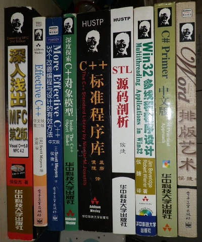
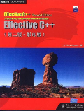
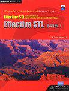
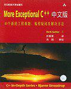
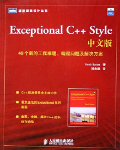

# C++, Farewell~

年纪到了，就开始返璞归真。聚焦业务，不再把精力投入那些花哨的"语法糖"。

最近在 refactoring 自己的书架，把最喜欢的基本 C++ 书，也送出去了。:-)

包括收藏了很久的 jjhou 的几本书。


## 侯捷(jjhou)

侯捷，台湾技术作家。在大陆 C++ 风靡一时的时候，我觉得大部分学习过 C++ 的程序员，都读过 jjhou 的书。能把技术书籍写得文雅清秀，我看过的技术书作家中，应该无人能出其右。我最喜爱的中文技术作家，没有之一。

jjhou 个人网站（[http://www.jjhou.com][29]）已经无法访问，随着 C++ 技术教育不再那么流行，jjhou 也慢慢谈出这个时代。在他网站上，有很多90年代初，给台湾技术杂志写的技术小段子，非常有意思。我久不久都会去翻翻。失联了呀，有点可惜。

知乎上找到的[一张图片][30]，每一本我都有 :-)，一份回忆。现在只留着《Win32多线程程序设计》《Word排版艺术》。



网易云课堂上还能看到 [jjou的课程][31]，还在讲 C++。偶尔也能收到技术培训公司的广告邮件，还能看到 jjhou 的身影。:-)

新生代程序员，我已经不推荐你们去看 C++ 了。Java、C#、go、node.js、python，在应用程序语言群雄并立的年代，C++，必将远去。


## C++学习历程

大学开始学习 C++，直接开始啃 Lippman 的 [《C++ Primer》][5]（还有本《C++ Primer Plus》，和 Lippman 没毛关系，别看）。不过大部分语法特性，都是边写边用学会的，[《C++ Primer》][5] 太厚，没认真读完一遍。哈哈。

```C++
#include <iostream>

int main(void) {
    std::cout << "Hello, C++!" << std::endl;
}
```

学习 C++ 的过程中，还去看了 Charles Petzold 的《[Programming Windows 5th][6]》，基本了解了 Win32 API，理解了 Windows 一个窗体消息循环的样貌。

当时市面上流行的 Win32 GUI 制作方式，是 MFC，在还不会 MFC 编程的基础上，开始读 jjhou 的 [《深入浅出MFC》][4]，里面影响最深的是"勿在浮沙筑高台"那一章，将类、继承、多态等等概念，都讲清楚了。还模拟了 MFC 整个 Message Bump 的实现。

其实，更推荐先看《[Programming MFC][7]》，再读[《深入浅出MFC》][4]。先学会使用 MFC，再去研究原理。就不会像我，看完整本 [《深入浅出MFC》][4]，却不会写 MFC 程序。如今，MFC 肯定不要学了，C++ GUI 主流应该是 [Qt][17]。

从现在来看，MFC 这套东西，无非是做了一套反射系统。当年，第一次见识，心情澎湃、兴奋无比。

C++ 有了基础之后，在老师推荐下，开始看 Scott Meyers 的《[Effective C++][8]》，然后顺道把《[More Effective C++][9]》和 [Herb Sutter][11] 的《[Exceptional C++][12]》《[More Exceptional C++][13]》《[More Exceptional C++ Style][14]》，都看了一遍。

毕业之后，还买过《[Effective STL][15]》，不过就没看了。

当年人邮出版的这一堆 C++ 书籍，都是红色封面，放在书架上，煞是好看。

     

上面这些 Effective XXX 太多了，[Herb Sutter][11] 又总结出精华，出了本《[C++ Coding Standards][18]》。我觉得有偏稿费的嫌疑。其实这一大堆 Effective XXX，只需要读最早的两本《[Effective C++][8]》[More Effective C++][9]》就好。

之后又买了 Bjarne Stroustrup 的《[The C++ Programming Language][16]》来收藏。因为对 C++ 已经很熟悉，基本就没去再读这本基础书。

大学还看 Lippman 的 [《Inside the C++ Object Model》][3]，从编译器的角度，讲解了如何实现 C++ 的语法，特别是 virtual function 的实现 -- vtable。如今面试，所有学生都会准备一下 vtable 的面经，不管是否真的理解。因为问问题的这一群面试官，都是从 C++ 鼎盛时代长大的，总会问到 vtable。:-)

读这些 Effective XXX，总觉得没啥实践。感觉不会写 C++ 代码。之后又读了《[道法自然][19]》《[C++实践之路][20]》。这两本，是 C++ 实践的好书，接地气，讲解的都是具体问题。

 * 《[道法自然][19]》，讲了一个嵌入式 GUI 系统应该怎么 OO
 * 《[C++实践之路][20]》，讲了怎么 OO 的封装 Win32 API，我现在 Win32 API 的封装方式，还在沿用这里面介绍的内容

写代码的过程中，经常要用容器，就去看《[The C++ Standard Library][21]》，又喜欢弄懂原理，而且 jjhou 写书风雅有趣，又读了《[STL源码分析][22]》。

读书到此，都还算没脱离 C++ 正轨。直到后来开始玩 template，一入魔道，道已偏。

**不推荐读**的 C++ 书籍

 *《[C++设计新思维][23]》
 *《[Imperfect C++][24]》
 *《[C++ Templates: The Complete Guide][25]》
 *《[C++ Template Metaprogramming][26]》

我看过《[C++设计新思维][23]》，对 Alexandrescu 把 C++ template 玩得如此神乎其神表示惊奇不已。除非是你要去维护 [boost][27] 的代码，否则上面这几本书，还是不要碰了。哈哈。

我试过两次看《[Imperfect C++][24]》和《[C++ Templates: The Complete Guide][25]》，实在看不下去。

不过，经过这么多 C++ 书籍熏陶，有个好处，基本 C++ 编译器的报错，我大约都知道为啥。:-)，什么 template partial specialization 我都懂。嘿嘿。读 [boost][27] 代码也不吃力。


## C++的过去与未来

展望。

回到 2002 - 2006 那个岁月，C++98 的标准确立不久，整个国内外都在一种 C++ 的热浪当中。国内引入了很多 C++ 的技术书籍，大家都在实际项目中引入 C++，以及去学习，如何用好 C++。

替代者：C、Java、C#、go、Python、Javascript(node.js)

就和 lisp 一样，终将被替代。

## 项目背景介绍

C/C++ 代码行数
Python 代码行数


## 别人的评价

云风很早就开始抵制 C++，新写的代码，只用 C，拒绝 C++。《[看着 C++ 远去][28]》


pongba 的 [C++11（及现代C++风格）和快速迭代式开发][1]

kcp 作者林大哥写过一篇 [什么时候用C而不用C++？][2]

[1]:http://mindhacks.cn/2012/08/27/modern-cpp-practices/
[2]:http://www.skywind.me/blog/archives/1407
[3]:https://book.douban.com/subject/1484262/
[4]:https://book.douban.com/subject/1482240/
[5]:https://book.douban.com/subject/24089577/
[6]:https://book.douban.com/subject/1456779/
[7]:https://book.douban.com/subject/1128016/
[8]:https://book.douban.com/subject/1842426/
[9]:https://book.douban.com/subject/1241385/
[10]:https://book.douban.com/subject/1241385/
[11]:https://herbsutter.com/
[12]:https://book.douban.com/subject/1241386/
[13]:https://book.douban.com/subject/1244943/
[14]:https://book.douban.com/subject/1470842/
[15]:https://book.douban.com/subject/1243751/
[16]:https://book.douban.com/subject/7053134/
[17]:https://www.qt.io/
[18]:https://book.douban.com/subject/1480481/
[19]:https://book.douban.com/subject/1231194/
[20]:https://book.douban.com/subject/1102104/
[21]:https://book.douban.com/subject/1786365/
[22]:https://book.douban.com/subject/1110934/
[23]:https://book.douban.com/subject/1119904/
[24]:https://book.douban.com/subject/1470838/
[25]:https://book.douban.com/subject/1455780/
[26]:https://book.douban.com/subject/1920800/
[27]:https://www.boost.org/
[28]:https://blog.codingnow.com/2007/02/cplusplus.html
[29]:http://www.jjhou.com
[30]:https://www.zhihu.com/question/28400554
[31]:https://study.163.com/courses-search?keyword=%E4%BE%AF%E6%8D%B7#/?ot=5
