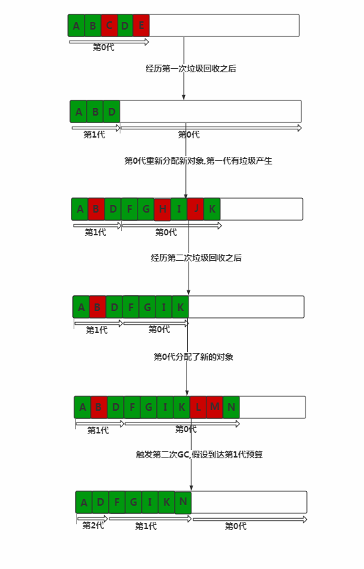
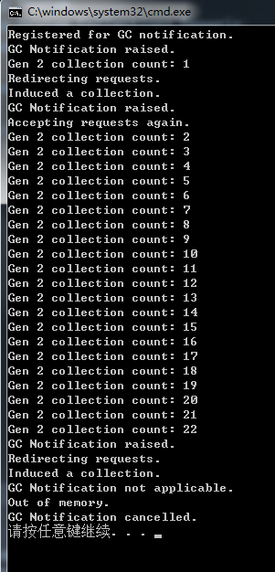
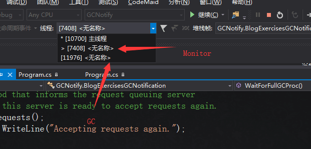
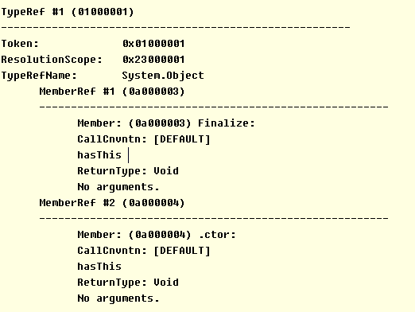
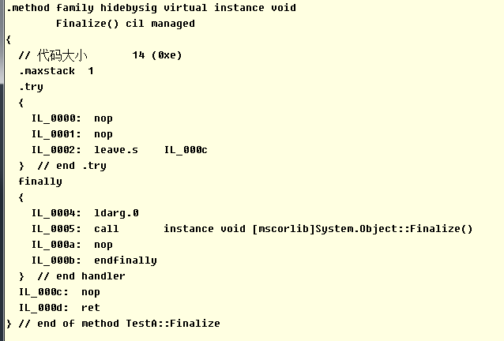
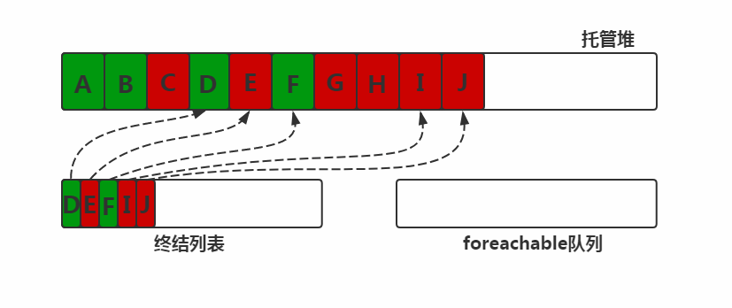
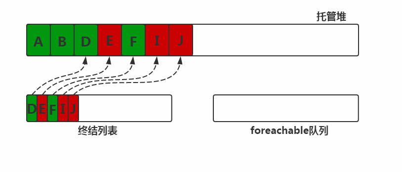
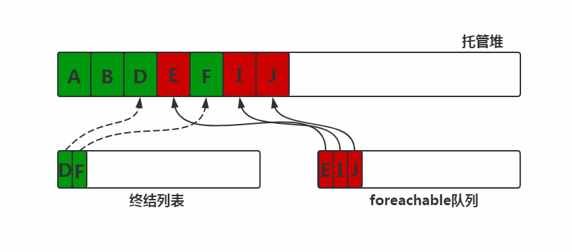
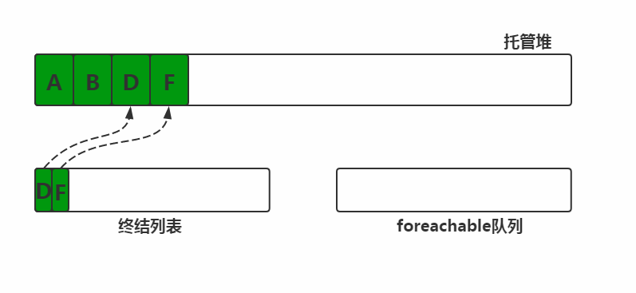

# Managed Heap＆CSharp GC Principle(上篇)

本文主要是对《CLR via C#》一书中GC的总结，分上下两篇．

## 目录
- [介绍](#介绍)
- [ManagedHeap内存分配](#ManagedHeap内存分配)
- [GCPrinciple](#GCPrinciple)
- [Generation的设计](#Generation的设计)
- [GCCondition](#GCCondition)
- [GCNotifications](#GCNotifications)
- [Finalize和IDisposable](#Finalize和IDisposable)
- [参考资料](#参考资料)

## 介绍

GC(Garbage Collection)，主要作用是 __帮助开发者自动管理应用程序内存__. GC试图去回收在程序中不再需要使用的对象占用的内存。最初是由John McCarthy在1959年在Lisp语言中提出的。

了解GC，好处诸多，其中之一就是代码规范，避免出现写出类似下面这种代码：

``` csharp
    FileStream fs = null;
    StreamWriter sw = null;

    try
    {
        fs = new FileStream(Environment.CurrentDirectory + "/Test.txt"， FileMode.OpenOrCreate);
        sw = new StreamWriter(fs);
        //TODO
        //....
    }
    catch (Exception ex)
    {
    }
    finally
    {
        if (sw != null)
            sw.Dispose();
        if (fs != null)
            fs.Dispose();
    }
```


## ManagedHeap内存分配

通常在C#中，我们使用资源需要经过以下流程:  
1．调用IL指令newobj，为代表资源的类型分配内存;  
2．设置资源的初始化状态(通过调用类型的实例构造器来完成)；  
3．在实例的生命周期内访问资源(重复)；  
4．摧毁资源的状态以进行清理(可选，目前未找到实例验证)；  
5．释放内存．


从IL上看，分配内存和初始化是一条语句，因此下面将这两个操作合并．
简化之后的流程可以概述为：__分配 & 初始化->使用->释放__

分配的详细流程又可概括为：  
1．计算类型的字段(以及从基类型继承的字段)所需的字节数；  
2．加上实例对象所需要的额外开销(类型对象指针和同步块索引)；  
3．CLR检查Managed Heap中是否有足够的空间容纳实例对象所需要的字节数，若有，则分配，反之，则触发GC进行回收．  

如下图：我们可以发现fs对象中的字占用了228个字节．


如果仔细验证分配规则，如下：
``` csharp
    public class TestA
    {
        public int id;
        public string Name;

        public TestA(int ID, string Name)
        {
            this.id = ID;
            this.Name = Name;
        }
    }
    public class GCTest_1
    {

        static void Main(string[] args)
        {
            TestA a = new TestA(1, "zh");
        }
    }
```


如上，*.cs使用的是unicode编码，所以在这里一个字母是2个字节，所以CLR为对象a分配了总共8个字节的内存空间，加上同步块索引和类型对象指针，正好16字节．
因此，验证了书中在Managed Heap中内存分配的规则．

## GCPrinciple
因Managed Heap的内存不是无限的，所以需要GC释放内存来使程序可以使用更多的资源．在GC进行释放内存时，需要确定哪些资源是需要被释放的．
由此引入引用跟踪算法．过程如下:  
1．CLR开始GC时，会挂起应用程序的所有进程，避免在CLR检查Managed Heap中的对象时，对象的状态会被改变；  
2．CLR把Managed Heap中的每个对象的同步块索引中的一位设为0．0 表示对象将被回收；  
3．CLR遍历活动根，查看哪些引用了堆中的对象．在Managed Heap中将其标记为1；  
4．遍历Managed Heap，将标记为0的进行垃圾回收；  
5．压缩Managed Heap中的对象；  
6．重新确定活动根中引用对象的地址．  

以上，是不考虑 __Generation__ 的情况下的GC回收过程.

## Generation的设计
考虑到GC对程序性能的影响，也就是不可能每一次都去遍历Managed Heap中所有的对象，而且在此过程中会Stop　the　World，所以　CLR引入了Generation来提升了
GC的效率．  
在GC中 Generation 包含三个，Gen0、Gen1、Gen2，可以理解为这是逻辑上对Managed Heap的划分，每个Generation都有自己的预算，当超过这个预算时，即会触发GC.
如下：  



CLR在初始化的时候，会为每一个Generation都设定一个预算大小，然而这个大小可以通过GC自己来调节．预算大小是根据每次GC之后幸存的对象的数目来确定的．
每次幸存者数目多，则扩大预算，反之，则缩小Generation的预算．

## GCCondition
- 代码显示调用System.GC的静态Collect方法
- Window 报告低内存的情况
- CLR 正在卸载Appdomain
- CLR 正在关闭

## GCNotifications
当CLR 执行Full GC(指对Gen2回收)，可能对系统产生一些性能影响.比如GC发生时,当前服务器Stop The World,但是此时，有大量的客户端请求进来,这些请求就将会延迟处理.
针对这种在特殊时期发生GC,你可以将请求重定向到另外一个服务器实例，在本服务器实例上释放一些不需要再处理的请求，以便在即将发生的GC中回收这些请求.  
示例代码:[GC Notifications Code Demo](2019_01_05_managed_heap_and_gc_principle_code/BlogExercisesGCNotification.cs)  
执行这个Demo时,请关闭GC的并发模式,若是Console,修改App.config如下:
```csharp 
  <runtime>
    <gcConcurrent enabled ="false" />
  </runtime>
```



代码分析:  
此程序主要是监控 __Full GC__,每当发生一次__Full GC__之前，就去释放load，以便在真正GC的时候进行内存释放.  
日志如上,第一次__Full GC__的时候监控到了,之后由于线程未及时切换,没有释放load,所以load占用的内存达到进程上限(Window7 64系统中分给一个进程最大的可用内存时4G).  
内存大小 = 3509153/(1024*1024) = 3.347G,最后抛出Out of Memory异常  




## Finalize和IDisposable
这个问题是额外添加的。发生在与劲哥讨论时抛出来的，当时我确实未留意GC是如何处理这两个方法的.特此记录一下.    

### 终结器Finalize的引入  
__缘由:__ 包含本机资源的内容被GC时，GC会回收对象在Managed Heap中使用的内存.但是这样会造成本机资源的泄漏，由此，引入Finalize来解决此问题  
__调用时机:__ 当GC判定一个对象不可达时，首先会调用Finalize，释放本机资源，然后再释放Managed Heap中的内存.  
__语法:__ System.Object定义了虚方法的Finalize  
  
如上，这是System.Object的源码，并没有直接发现Finalize方法，这或许是微软在编译mscolib.dll是处理这个的，有以下两种方式可以验证:  
__Ａ．通过dnspy反编译mscorlib.dll__  


如上，反解出来可以发现~Object方法没有了，取而代之的是Finalize方法  

__Ｂ．查看Dll的元数据表__  
  

如上，我们在类型引用表中可以发现Object.Finalize.因此，我们确定了Object中确实存在一个虚方法的Finalize  

### 终结器Finalize做了啥?
首先，分析空的终结器，C#代码如下
``` csharp
    class TestA
    {
        ~TestA()
        {
        }
    }
```
IL指令如下:  
  

如上，我们发现 __类__ 类型若写了终结器，会去调用基类System.Object的终结器

### CLR是如何处理终结器的(内部工作原理)?
Ａ．如果一个类型显示定义了Finalize方法，当调用该类型的实例构造器之前，会将指向该对象的指针放到一个终结列表中  
  
Ｂ．当第一次GC发生时，当一个对象被标记为垃圾之后并且不再终结列表中，则会被直接回收.反之，则会在终结列表中删除该指针，并把它附加到foreachable队列中  
  
  
Ｃ．CLR会创建一个特殊的高优先级的线程将foreachable队列中的元素依次移除，并调用其Finalize方法.最后，在下一次GC的时候，已终结的对象才会被GC真正的回收  
  

综上，可以发现用Finalize来处理本机资源是由CLR自动完成的.Managed Heap中的包装对象被回收时至少是2次才能完成，但是很多时候，第一次GC之后，包装对象就被提升了一代，
可能需要更多次数的GC才能被完全回收.  

### IDisposable 的引入
如果完全将本机资源交给CLR来管理，就会出现如下的问题:  
``` csharp
        static void Main(string[] args)
        {
            Byte[] bytesToWrite = new byte[] { 1， 2， 3， 4， 5， 6， 7 };

            FileStream fs = new FileStream("Temp.dat"， FileMode.Create);

            fs.Write(bytesToWrite， 0， bytesToWrite.Length);

            File.Delete("Temp.dat");
        }
```
本机资源的释放必须是在GC之后，因此无法确定资源什么时候被清理.所以，在调用File.Delete的时候会大概率报错.
因此，引入IDisposable来手动控制本机资源的生命周期.
IDisposable定义如下:
``` csharp
public interface IDisposable {
        void Dispose();
    }
```

### Dispose具体做了哪些事?
首先，需要明确Dispose只是清理了本机资源，而在Managed Heap中的包装类对象必须在GC的时候才会被清理.

### Finalize和Dispose的比较和冲突
Finalize:  
- 清理本机资源的时间不确定
- 多个Finalize调用的顺序不明确
Dispose:  
- 可以手动控制本机资源的生命周期，在调用的时候必须保证本机资源不再使用了

案例分析:
若一个类型包装的本机资源，既实现了IDisposable接口，也添加了Finalize方法，就可能会会出现资源被二次卸载的问题.
代码如下:
``` csharp
    class TestA:IDisposable
    {
        ~TestA()
        {
            Console.WriteLine("call TestA.Finalize()");
        }

        public void Dispose()
        {
            Console.WriteLine("call TestA.Dispose()");
        }
    }
```

解决方法:确保Finalize和Disposable只有一个会被调用即可
C# 中的SafeHandle即解决以上问题:
``` csharp
    abstract class SafeHandle:CriticalFinalizerObject，IDisposable
    {
        protected IntPtr handle; 
        private bool _ownsHandle;

        protected SafeHandle(IntPtr invalidHandleValue， bool ownsHandle)
        {
            handle = invalidHandleValue;
            _ownsHandle = ownsHandle;

            if (!ownsHandle)
                GC.SuppressFinalize(this);
        }

        protected void SetHandle(IntPtr handle)
        {
            this.handle = handle;
        }

        protected abstract bool ReleaseHandle();

        public void Close()
        {
            Dispose(true);
        }

        public void Dispose()
        {
            Dispose(true);
        }

        protected virtual void Dispose(bool disposing)
        {
            //TODO
            //1.若本机资源被释放，直接返回
            //2.调用ReleaseHandle方法释放本机资源
            //3.通知GC不要调用Finalize方法 GC.SuppressFinalize(this);             
        }

        ~SafeHandle()
        {
            Dispose(false);
        }

    }
```

__ps:CriticalFinalizerObject__
被CriticalFinalizerObject标记的类型及派生类型对象有以下三个特征:
- 继承结构层次中的所有Finalize方法都会在首次构建对象的时候被JIT编译
- 非CriticalFinalizerObject的Finalize方法调用晚于CriticalFinalizerObject的Finalize方法的调用
- 若AppDomain被强行中断，CLR将会调用CriticalFinalizerObject的Finalize方法

### 特殊约定
- 从System.Object继承的Finalize，GC会默认忽略它，只有重写的，才会默认此类型及派生类型的对象是可以终结的

## 参考资料
CLR via C# 第四版第二十一章


