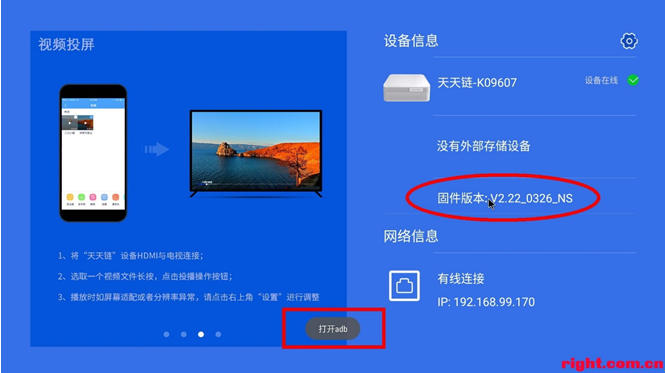
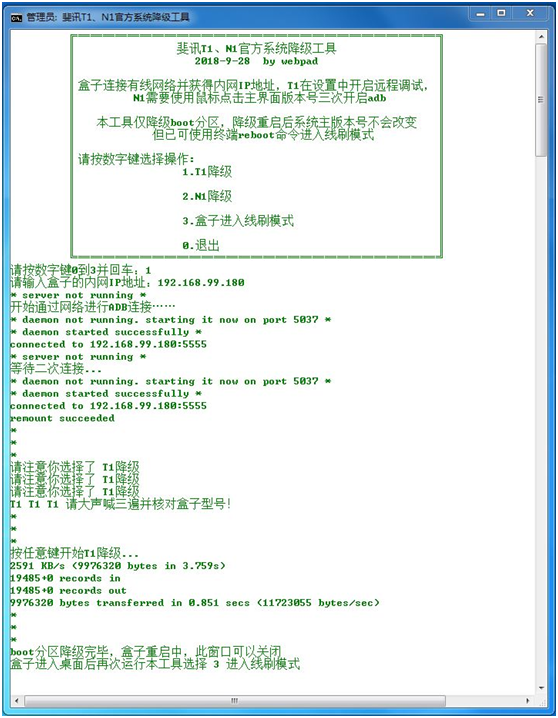
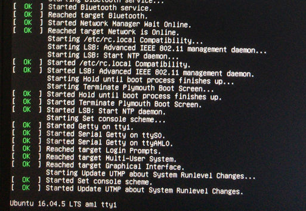

# 斐讯N1刷armbian最简操作


## 前言

最近买了台 [SolidRun CuBox i4p][1]，被顾QQ批评为"太贵了"。他最近正好在刷 N1盒子，[闲鱼][2]上75块包邮，性价比超高。听罢，我也在[闲鱼][2]上弄了台N1。

这篇是顾QQ刷N1盒子的记录。等我的N1盒子到货，准备刷个 OpenBSD 玩玩。


## 准备工具

 * N1 一台
 * USB 双公口线一条
 * 4G 以上 U 盘一个，新 U 盘可能有兼容性问题（最好是USB2.0设备或SD卡加读卡器）
 * 可以运行安卓adb工具的电脑一台，win/mac/linux都行


## 降级 bootloader 方法一（fastboot）

首先下载文件 

 * 微云：[https://share.weiyun.com/5vAkZ7p][3] 密码：nzwy53

将N1接上网线，HDMI线接显示器，离HDMI口远的那个USB口接一个鼠标。连上网以后，等个五分钟左右，待其自动升级到最新版，中间可能会多次重启升级，直到不再升级为准。否则如果正在刷的过程中N1重启可能会有点麻烦。

接下来用鼠标点击屏幕上版本号的地方4次，屏幕中间会显示一下“开启adb”。



将 N1 上距离 HDMI 口近的那个 USB 口和电脑之间用 USB 双公头线连接，并让电脑和N1处于同一局域网下，首先执行

```
adb connect <N1的IP地址，可以在N1屏幕上看到>
adb shell reboot fastboot
```

此时应该可以看到N1重启黑屏，接下来在电脑上执行

```
fastboot devices
```

如果能够显示出一行设备信息，说明 USB 连接正常，将最开始下载的文件包中 boot.img bootloader.img recovery.img 三个文件放在当前目录下，并执行

```
fastboot flash bootloader bootloader.img
fastboot flash boot boot.img
fastboot flash recovery recovery.img
fastboot reboot
```

如此便完成了bootloader 降级。


## 降级 bootloader 方法二（adb）

1. 盒子插网线接入和电脑同一局域网，记下盒子获得的内网IP地址；
2. N1在主界面使用鼠标点击四次固件版本号打开adb
3. 下载一键降级包：[https://share.weiyun.com/5klmuxd][4]，密码：yaefa9
4. 根据提示操作




## 制作Armbian启动盘

首先从 [https://yadi.sk/d/pHxaRAs-tZiei][5] 下载最新的版本，因为我最后还是要刷成 CentOS，所以下个最小的就行，比如 Debian 不带 desktop 的版本。将 .xz 文件解开以后是个 .img 文件。将这个文件用 [Win32DiskImager][6] 或者 USB Image Tool ，或者在 linux 下 dd 直接写入 U 盘。

接下来打开第一个分区，在 Windows 上面应该是一个 BOOT 分区，下载 

 * [https://github.com/yangxuan8282/phicomm-n1/releases/download/dtb/meson-gxl-s905d-phicomm-n1.dtb][7]

该dtb用于替换meson-gxl-s905d-p230.dtb，可解决传输大文件掉线、系统负载始终2.0的bug。

把该文件放到 dtb 目录下， 用文本编辑器编辑根目录下面的 uEnv.ini ，将里面 dtb 一行替换成这个文件的名字并保存，Armbian 启动 U 盘就做好了（从5.55的20180922版本开始已经无需将meson-gxl-s905d-phicomm-n1.dtb复制为根目录下的dtb.img）。


## U盘启动Armbian

N1的两个 USB 口，离HDMI口远的接 U 盘，另一个接 USB 键盘。HDMI 线接显示器，加电冷启动。屏幕会先出现启动画面，之后会进入U盘armbian启动界面。如果没法启动到U盘armbian，启动后执行：

```
adb connect <your ip address>
adb shell reboot update
```

此时N1会黑屏两次，然后进入U盘armbian系统。

这里如果多次重复，还是只能进入Android的recovery模式，那么请换个 U 盘再试，基本这里不成功都是因为 U 盘兼容性问题导致的。最好是 USB 2.0 的 U 盘。

进入 Armbian 以后用 root:1234 登录，会被要求修改密码和创建普通用户，不想创建用户可以Ctrl+C跳过，完成以后会留在一个 shell 里面。

我是Ctrl+C调过了，没有启动到桌面，不知道是否和这个有关，回去再试一下。


## 备份盒子系统和数据

如果需要保留原eMMC内的电视盒子/Linux系统数据，输入"ddbr"后根据提示操作备份。


## 刷入Armbian系统

在U盘系统/root文件系统中执行

```
./install.sh
```

完成以后，拔电源或者命令行输入shutdown，拔掉 U 盘，重新上电启动，应该就可以看到 Armbian 系统启动了。另 USB Burning Tool，没有试过。

完成以后，断电，拔掉 U 盘重启，应该就可以看到 Armbian 系统启动了。




## deb方式升级内核

deb升级文件使用方法（免去重装系统烦恼）：下载目录180829/deb下的文件，解压（用winscp或scp）导入armbian后，在相应目录执行：

```
apt remove -y armbian-firmware
dpkg -i *.deb
```

## Armbian配置无线网卡

 * 4.x.x内核armbian-config
 * 3.x.x内核modprobe dhd

## Troubleshooting

### error: device not found

执行adb devices等命令的时候报错，试试执行 adb kill-server，如果还不行，建议杀死 adb 进程。

### 刷机出现权限问题

驱动到U盘或者写入eMMC后，执行 ls –ll / 命令发现，有些文件系统的权限不是root:root，因为有些错误的教程让大家在Android里就插入U盘，但是这样会导致主分区被污染，所以会导致权限紊乱。我们需要做到新做U盘的ext4主分区不能被暴露。

 * 解决办法一：写入eMMC前，执行 adb shell reboot update 等系统黑屏后再插入U盘
 * 解决方法二：写入eMMC后，重新制作U盘系统，然后插入优盘重新引导，重装系统

### 安装成功后无法进入eMMC盘系统

该问题只存在于5.44及之前版本系统，复制dtb.img文件的时候，产生了东八区的时间戳，而镜像系统默认是格林威治时间。于是就造成了系统不识别"来自未来的8个小时之后的"文件，所以引导失败。

解决方法：操作写入eMMC之前，执行以下命令修复时间

```
touch /boot/dtb.img
```

### 关于断流问题

经过调研发现，不是某一系统或某一设备的单独现象，网上的案例非常非常多。nml写了一个脚本，可以无人值守维持有线网络。


## 软件列表

 * [USB Image Tool][17]
 * [Win32 Disk Imager][6]
 * [SD CardFormatter][18]	
 * [USB Burning Tool][19]


## 硬件参数

 * CPU: [Amlogic S905D][13] ([ARM Cortex-A53][12])
 * RAM: 2G DDR3
 * 8G eMMC
 * Ethernet: RTL8211F Gigabit Ethernet
 * WIFI/Bluetooth: ? CYW43455 ( same as Raspberry Pi 3B+ ) 5G WiFi IEEE 802.11n/ac with Integrated Bluetooth 4.1 [Datasheet]

对比了下，和 [CuBox i4p][1] 差不多。75块这个价格，真是便宜。其中，[eMMC][11] 就是硬盘。


## 耗电计算

 * 电压/电流：12V 2A
 * 功耗：12*2 = 24W
 * 1度电：1000W/小时
 * 每月耗电：(24*30) / (1000/24) = 17.3 度
 * 电费单价：南方电网，第一档 0.59/度；第二档，0.64/度
 * 每月电费：0.64*17.3 = 11.07 元

夏天24小时开机，一个月11块，还能接受。


## 参考资料

 * [https://www.right.com.cn/forum/thread-340279-1-1.html][8]
 * [https://www.right.com.cn/forum/thread-322223-1-1.html][9]

----------------------------

**Updated 2018.11.23**

我的 N1 盒子终于到货了。

按方法二，很简单就可以"降级bootloader"成功。

* 以后对 N1 的研究，可以好好参考这里：[https://github.com/yangxuan8282/phicomm-n1/][15]
* [自己制作 N1 的 Linux 镜像][16]

但做好的 armbian U盘，一直启动不成功。只能等顾QQ给我邮寄那个刷机专用U盘了。:-)

**Updated 2018.11.27**

刷机成功，顾QQ邮寄给我的U盘没用。我用自己的，刷成功了。=_=!


[1]:https://www.solid-run.com/product/SRMX6QDWT1D02GE008X00CE/
[2]:https://2.taobao.com/
[3]:https://share.weiyun.com/5vAkZ7p
[4]:https://share.weiyun.com/5klmuxd
[5]:https://yadi.sk/d/pHxaRAs-tZiei
[6]:https://sourceforge.net/projects/win32diskimager/
[7]:https://github.com/yangxuan8282/phicomm-n1/releases/download/dtb/meson-gxl-s905d-phicomm-n1.dtb
[8]:https://www.right.com.cn/forum/thread-340279-1-1.html
[9]:https://www.right.com.cn/forum/thread-322223-1-1.html
[10]:http://www.cypress.com/documentation/datasheets/cyw43455-single-chip-5g-wifi-ieee-80211nac-macbaseband-radio-integrated
[11]:https://www.kingston.com/en/embedded/eMMC
[12]:https://developer.arm.com/products/processors/cortex-a/cortex-a53
[13]:http://mxqproject.com/amlogic-s912-vs-s905/
[14]:https://developer.android.com/studio/#downloads
[15]:https://github.com/yangxuan8282/phicomm-n1/
[16]:https://github.com/yangxuan8282/phicomm-n1/wiki/%E8%87%AA%E5%B7%B1%E5%88%B6%E4%BD%9C-N1-%E7%9A%84-Linux-%E9%95%9C%E5%83%8F
[17]:https://www.alexpage.de/
[18]:https://www.sdcard.org/
[19]:https://www.atvxperience.com/download/amlogic-usb-burning-tool/
