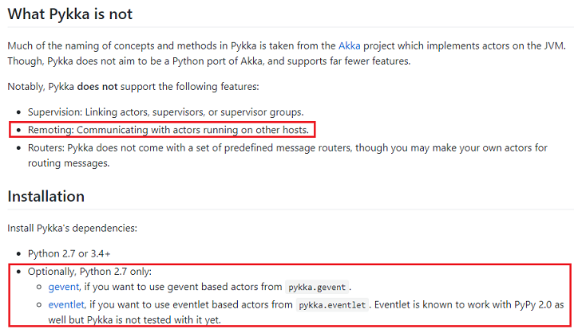

# [fatserver] Design Principle

一直想自己写个 game server 来玩玩。以前 [fatfatson][2] 的客户端引擎叫 fatengine，我的这个就叫 [fatserver][3] 好了。

记录下所有设计上的思考。

## KEY-POINT

 * C / Python / Pypy
 * Actor-based, distributed game server framework

## ARCHITECTURE

core

 * [fatuv][7]，最底层的网络库，cffi + python/pypy
 * fatkernel，一个 single process/multi threading 的轻量级 game server
 * fatskynet，一个 distributed multi-process game servers
 * kernel & skynet，对于业务来说，都是 entity-based，统一行为。

tools

 * fatbench，一个简单的性能测试工具

## NOTES

### 2018.11.28

fatfatson 给了一个用 C# 实现的分布式 game server -- [ET][1]。瞄了一眼，基本实现了我想做的所有功能。不过代码细节上可以再扣细一点，性能可以更好。

想起 [Orleans][4] 和 [Akka.NET][5] 项目。认真看了下 [Akka.NET][5] 的文档。在模拟 erlang 的这条道路上，[Akka.NET][5] 已经做得很好了。设计上，erlang 是很通用的，并不局限于游戏项目。

fatserver 的第一个目标，对 Akka.NET 做一次全面 clone，看看有多少东西是别人设计得好的。之后再根据游戏业务，做一次裁剪。

我的初步判断是，[Akka.NET][5] 做得很通用。游戏业务，只不过是用好它提供的基础设施，然后加一些游戏相关的模块就好了。

把 [Akka.NET][5] 作者的[blog文章汇总][6]。

有人做了个 [pykka][8]。不过既不支持分布式，网络库又不能直接跑在 pypy 上。和 [Akka.NET][5] 相比，只是个玩具。

### 2018.10.20

 * 开始研究 [libuv][12]
 * 通过 [cffi][13] 将 [libuv][12] 注册给 python
 * 用 C 实现 [uvloop][9] 的所有测试用例，作为 benchmark 的测试基准
 * [cffi][13]/[libuv][12] 实现 [uvloop][9] 的所有测试用例，然后做 benchmark
 * 对比测试下 [pyuv][10] 的性能
 * 参考 [AsyncNet][11]，思考如何将 [libuv][12] 封装给 python

《英三》中的分布式设计

 * 之前《英三》实现了一套 Distribute Object Layer
 * 只有两个接口，sendto("ljwang.game", msg) 和 transfer("ljwang.game", fromServer, toServer)
 * 有空详细再讨教这一块

### 2018.02.04

传统来说，继承 logger.Handler 实现自己的 output stream。但 logger.Handler 里面有 lock，在 actor-based 设计里面，不需要 lock。所以不能从 logger.Handler 继承，而是直接实现一个 logger.Handler 接口。

libuv createTimer() timeout 参数 = 0 时，是下一帧触发。fatkernel.ActorContainer 利用这里逻辑来实现 actor 之间 message-passing。

### 2018.02.03

将整个框架分为两部分 fatkernel 和 fatskynet

fatkernel

 * 单进程/多线程结构
 * 支持 network/timer/actor-message-sending/log/database
 * 支持 C/C++ module 扩展（这个要继续研究下 libuv）
 * 可以不依赖 fatskynet actor-based 的结构
 * 简单的游戏，用这个框架就足够了

fatskynet

 * 在 fatkernel 基础上的分布式服务器结构

### 2018.02.01

想参考下 J2EE 的设计。

白天学习了下 Java EE 7 + WildFly，真是太复杂了。虽然一些接口和思路设计都不错，但 EJB 真不是人用的。难怪这年头互联网公司没人玩 Java EE 了。

EJB 把多线程概念暴露给开发者，这其实增加了很多复杂度，看起来是可以并发，其实还是线程模型没有设计好。

python 虽然有 GIL，但利用 libuv，可以做到 python main thread 处理游戏逻辑，然后其它所有逻辑交其它线程。txos 证明这个方法是高效的。

然后再配合 MobileServer 思想去分布式，基本可以解决的大部分游戏需求。而且开发高效。

### 2018.01.25

 * 给服务器增加 log_server，所有log通过socket发送给 log_server
 * log_server 单进程，如果需要优化，write() 可以不要用 lock 版本

[1]:https://github.com/egametang/ET
[2]:https://fatfatson.github.io/
[3]:https://github.com/kasicass/fatserver
[4]:http://dotnet.github.io/orleans/
[5]:http://getakka.net/
[6]:https://github.com/kasicass/blog/blob/master/fatserver/2018_11_28_akka_net.md
[7]:https://github.com/kasicass/fatuv
[8]:https://github.com/jodal/pykka
[9]:https://github.com/MagicStack/uvloop
[10]:https://github.com/saghul/pyuv
[11]:https://github.com/skywind3000/AsyncNet
[12]:http://libuv.org/
[13]:https://cffi.readthedocs.io/en/latest/
