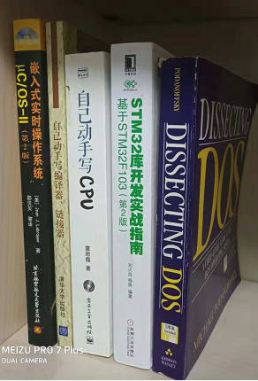

# Road to The Kernel

## TODO

uC/OS-II

* 读书[《嵌入式实时操作系统uC/OS-II(第二版)》][1]
* 重读 uC/OS-II 代码

ESBB

* 读书[《Embedded Systems Building Blocks - 2nd》][17]
* 读 ESBB 代码

Compiler/Linker

* 读书[《自动动手写编译器、连接器》][18]
* 支持 x86、amd64、armv7、mips64el

Hardware

* 读书[《自己动手写CPU》][19]
* 搞懂基本的CPU运作原理

uC/OS-III

* 读书[《uC/OS-III, The Real-Time Kernel》][12]
* 读 uC/OS-III 代码，和 uC/OS-II 做个对比

uC/OS-III on STM32

* 读书[《STM32库开发实战指南(第二版)》][3]
* 做完[这里][13]的例子

uC/OS-III on loongson

* ???

RxDOS

* 读书[《Dissecting DOS》][8]
* 读 [RxDOS][7] 代码
* 改写 RxDOS，变成 C + asm，增加可移植性

RxDOS on STM32

* ???

RxDOS on loongson

* ???

OpenBSD on loongson

* ???

OpenBSD on N1 box (arm64)

* ???

## uC/OS-II

 * [See uC/OS-II runs again~][14]
 * [编译 uC/OS-II 代码][15]
 * [第一章 - 初识 uC/OS-II][16]

## ESBB

 * [Keyboards][20]

## STM32

 * [初识 STM32][21]

## DONE

TODO

## NOTE

**2018.11.21**

想在 DOSBox 上编译 uC/OS-II，已经找不到 Borland C++ 4.5 了。想想，索性不如把 Compiler & Linker 都做了。

[《自动动手写编译器、连接器》][18]有现成的 C Compiler 的实现，能在 x86 上跑。只要支持下 armv7、mips64el，就可以把 uC/OS-II 移植到对应到平台了。不用再每个平台找编译器，帅。

[《自己动手写CPU》][19]实现了 OpenMIPS 标准的一个 CPU，同时还有 uC/OS-II 的移植范例，正好作为写 Compiler & Linker 的参考资料。

**2018.11.18**

一直对操作系统很感兴趣，最近打算重开"操作系统"这个大坑。

大学本科的时候（2002-2006），从读[《嵌入式实时操作系统uC/OS-II(第二版)》][1]开始入门，之后看了[《自己动手写操作系统》][2]，并仿照着了两本书，完成了一个简单的 kernel，作为毕业设计。

整个流程做下来，对 kernel、process、thread scheduling、context switch 都有了基本的认识，算是操作系统开发，入门了。

重新学习操作系统，打算还是从复习 uC/OS-II 入手，先在 win32(x86) 上把玩一下 uC/OS-II。之后升级到 uC/OS-III，看看新版本有啥改进。

再进入 STM32F103 板子，去玩一下 arm，试试真真的嵌入式开发。对比下 x86 和 arm 的指令集区别。

为何会选用[意法半导体][4]的 STM32 呢？因为 uC/OS-III 的原版书改用 STM32 作为介绍了，而且国内 STM32 的书籍也很多，说明这个板子市场接受度很高嘛。STM32F103 用的 32-bit CPU 是 [ARM Cortex-M3][6]。

还记得小学刚刚开始接触 386/486 电脑时，MS-DOS 6.22 是个永远刻在脑子里面的名词。cd、dir 这些指令，用了一辈子。

等 uC/OS 折腾完之后，回归情怀，准备玩一遍 DOS。正好之前淘到一本书[《Dissecting DOS》][8]，作者实现了一套 DOS 系统 -- [RxDOS][7]。

RxDOS 是全汇编写成的，争取改写为 C + asm 的方式，增强可移植性。然后移植到 loongson(mips64el) 上。谁让我买了台 [龙芯 All-in-one PC][9]，OpenBSD 系统一直没安装成功呢。

RxDOS搞完了，再开始回归 [4.4BSD][11]，读[《The Design of UNIX Operating System》][10]。再把 [4.4BSD][11] 移植到 loongson 上。

最后进入 OpenBSD 内核，让它能跑在我的 [龙芯 All-in-one PC][9] 上。

计划五年吧，应该可以完成。啊哈~

[1]:https://book.douban.com/subject/1229913/
[2]:https://book.douban.com/subject/1422377/
[3]:https://book.douban.com/subject/27076457/
[4]:https://www.stmcu.com.cn/
[5]:https://stm32.tmall.com/
[6]:https://developer.arm.com/products/processors/cortex-m/cortex-m3
[7]:http://rxdos.sourceforge.net/
[8]:https://book.douban.com/subject/4004552/
[9]:https://github.com/kasicass/blog/blob/master/openbsd/2018_10_23_openbsd_6.4_on_lynloong.md
[10]:https://book.douban.com/subject/1768601/
[11]:https://github.com/sergev/4.4BSD-Lite2
[12]:https://book.douban.com/subject/3996146/
[13]:https://github.com/BearZPY/STM32-uCOSIII
[14]:https://github.com/kasicass/blog/blob/master/ucos/2018_11_18_see_ucos2_runs.md
[15]:https://github.com/kasicass/blog/blob/master/ucos/2018_11_18_compile_ucos2.md
[16]:https://github.com/kasicass/blog/blob/master/ucos/2018_11_19_ucos2_examples.md
[17]:https://book.douban.com/subject/1840113/
[18]:https://book.douban.com/subject/26339438/
[19]:https://book.douban.com/subject/25960657/
[20]:https://github.com/kasicass/blog/blob/master/ucos/2018_11_23_esbb_keyboards.md
[21]:https://github.com/kasicass/blog/blob/master/stm32/2018_11_25_hello_stm32.md
