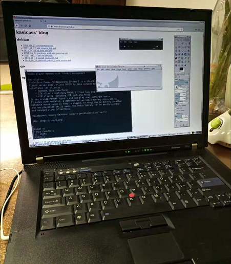

# [OpenBSD] Desktop on 6.4

之前写的 Desktop 相关内容已经比较老了。更新一版。

## 基本安装

安装 Window Manager -- [IceWM][2]

```
  1. 正常安装系统，X Window 可工作。我一般是登录后，用 startx 启动。

  2. cd /usr/ports/x11/icewm; make install，漫长等待后，icewm 终于装好了。（KDE, GNOME太重了，换个 lightweight 来玩玩）

  3. IceWM 的配置比较简单，默认配置会放在 /usr/local/share/icewm，把里面的内容全部 copy 到 ~/.icewm。基本结构：
     preferences     基本的配置
     menu            自己配置 start 菜单里面的内容
     theme           默认主题的路径 
     [icons]         常用 icon 都放在里面
     [themes]        所有主题
     ....
     IceWM 的配置确实不复杂，看看他的 tutorial  就好。

  4. startx 的 system-wide 配置文件在 /etc/X11/xinit/xinitrc，复制为 ~/.xinitrc
     $ cp /etc/X11/xinit/xinitrc ~/.xinitrc

     修改
     #  fvwm || xterm
     exec dbus-launch icewm-session

     $ startx

  5. 配置 IceWM 的主题也很简单，到 www.icewm.org 里面推荐的几个，全部下载放到 ~/.icewm/themes 里面，然后自己挑啦。
  ```

开始菜单中的内容，修改 ~/.icewm/menu。修改是实时生效的，不需要重启 icewm。

## 常用软件

```
# pkg_add -v <package name>

firefox-62.0.3p0           web browser
gnome-mplayer-1.0.9p6v0    video player
gimp-2.8.22p3              Photoshop
gpicview-0.2.5p2           ACDSee
xchm-1.23p1                chm viewer
xmms2-0.8p10               Winamp
```

## XTerm 设置

默认 xterm 的字体实在太小了，而且是 non-color 的。

修改 ~/.xinitrc，如下，漂亮的英文字体，大小也恰好。


```
xterm -fa 'Mono' -fs 14      # fa - fontface(字体), fs - fontsize(字体大小)
```

设置 colorful xterm


```
$ git clone https://github.com/solarized/xresources
$ cp xresources/Xresources.dark ~/.Xresources
$ xrdb -merge ~/.Xresources
```

关于 [.Xdefaults and .Xresources][1]

## 中文显示

修改 ~/.xinitrc，增加 LC_CTYPE 和 LANG

```shell
# 不设置 LC_CTYPE 也可以的，不过感觉这样英文好看了一点
export LC_CTYPE=en_US.UTF-8
export LANG=en_US.UTF-8
exec dbus-launch icewm-session
```

## 漂亮的中文字体 ([http://wenq.org][3])

下载 wenq-zenhei(正黑)

```
# cd /usr/X11R6/lib/X11/fonts/TTF
# cp /pathto/wqy-zenhei.ttc ./
# /usr/X11R6/bin/mkfontscale            # 给 X server 注册下
# /usr/X11R6/bin/mkfontdir
```

OK，字体已经装备上了，然后修改  icewm 的配置文件 ~/.icewm/preferences

英文用 Fixed, 中文用 WenQuanYi Zen Hei (wqy-正黑)：

```
TitleFontNameXft="Fixed:size=12,WenQuanYi Zen Hei:size=14"
MenuFontNameXft="Fixed:size=12,WenQuanYi Zen Hei:size=14"
StatusFontNameXft="Fixed:size=12,WenQuanYi Zen Hei:size=14"
QuickSwitchFontNameXft="Fixed:size=12,WenQuanYi Zen Hei:size=14"
NormalButtonFontNameXft="Fixed:size=12,WenQuanYi Zen Hei:size=14"
ActiveButtonFontNameXft="Fixed:size=12,WenQuanYi Zen Hei:size=14"
NormalTaskBarFontNameXft="Fixed:size=12,WenQuanYi Zen Hei:size=14"
ActiveTaskBarFontNameXft="Fixed:size=12,WenQuanYi Zen Hei:size=14"
ToolButtonFontNameXft="Fixed:size=12,WenQuanYi Zen Hei:size=14"
NormalWorkspaceFontNameXft="Fixed:size=12,WenQuanYi Zen Hei:size=14"
ActiveWorkspaceFontNameXft="Fixed:size=12,WenQuanYi Zen Hei:size=14"
MinimizedWindowFontNameXft="Fixed:size=12,WenQuanYi Zen Hei:size=14"
ListBoxFontNameXft="Fixed:size=12,WenQuanYi Zen Hei:size=14"
ToolTipFontNameXft="Fixed:size=12,WenQuanYi Zen Hei:size=14"
ClockFontNameXft="Fixed:size=12,WenQuanYi Zen Hei:size=14"
ApmFontNameXft="Fixed:size=12,WenQuanYi Zen Hei:size=14"
InputFontNameXft="Fixed:size=12,WenQuanYi Zen Hei:size=14"
LabelFontNameXft="Fixed:size=12,WenQuanYi Zen Hei:size=14"
```

根据网上的一些文章，说开启 anti-aliasing 中文效果不好，可通过下面的方法关闭之。不过我还是觉得 AA 之后，英文效果好太多，不舍得关闭。

```
$ vi ~/.fonts.conf
<fontconfig>
  <match target="font">
    <test compare="more" name="pixelsize" qual="any">
      <double>10</double>
    </test>
    <test compare="less" name="pixelsize" qual="any">
      <double>15</double>
    </test>
    <edit mode="assign" name="antialias">
      <bool>false</bool>
    </edit>
  </match>
</fontconfig>
```

## 中文输入

TODO

## MISC

TODO

```
加快上网速度

修改 firefox 配置

[http://www.openbsdonly.org/viewtopic.php?f=17&t=719&p=3833&hilit=firefox#p3833][7]

设置一个速度快的 DNS (/etc/resolv.conf)

[http://www.maoshen.org.cn/show.asp?Newsid=125][8]

ps. 不过 4.5 的桌面速度，感觉还没 4.4 快 - -#

我的 glxgears 在 4.4 跑的 500+ fps，而 4.5 DRI 开启后只有 100+ fps
```

## Screenshot

OpenBSD 6.4 desktop on Thinkpad T60p




[1]:https://superuser.com/questions/243914/xresources-or-xefaults
[2]:https://ice-wm.org/
[3]:http://wenq.org/

