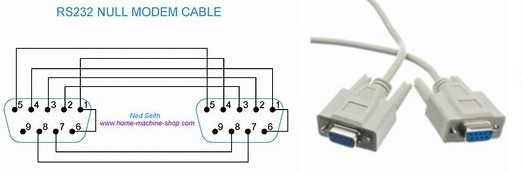

# [BookReading] Absolute OpenBSD 2nd

## 02 - Installation Preparations

### Partitioning

```
/             root，系统最重要的数据，比如 kernel binary：/bsd
swap          物理内存不足时，交换一些数据到此。大小一般为物理内存*2
/tmp          临时文件
/var          database的数据，以及各种log
/usr          操作系统的 programs, compilers, libraries
/usr/X11R6    X Window 的 programs 和 doc
/usr/local    额外安装的 programs(packages)
/usr/src      OpenBSD 源码
/usr/obj      编译 OpenBSD，中间文件放置区
/home         user 自己的数据
```

### Understanding Partitions

历史原因，一个硬盘（disk），必须分为MBR和disklabel两类分区。

* MBR Partitions，主引导分区，一个操作系统，需要一个MBR；一个硬盘可以有4个MBR
* Disklabel Partitions，从分区，一个MBR下面可以划分16个从分区。
* 用 fdisk(8) 来修改分区


### Understanding Disklabels

看看设备名，比如：/dev/wd0a

```
# df -h
Filesystem     Size    Used   Avail Capacity  Mounted on
/dev/wd0a      126G    2.0G    118G     2%    /
```

查看 disklabel 信息：

```
# disklabel /dev/wd0c 
# /dev/wd0c:
type: ESDI
disk: ESDI/IDE disk
label: VBOX HARDDISK   
duid: c8165a7a8554a263
flags:
bytes/sector: 512
sectors/track: 63
tracks/cylinder: 255
sectors/cylinder: 16065
cylinders: 16709
total sectors: 268435456
boundstart: 64
boundend: 268430085
drivedata: 0 

16 partitions:
#                size           offset  fstype [fsize bsize   cpg]
  a:        268430016               64  4.2BSD   2048 16384 12958 # /
  c:        268435456                0  unused  
```

sector / track / cylinder 是老的硬盘制作工艺上有的概念，但新的硬盘，比如：SSD，从物理角度上，已经没有这些概念了。但为了保持和操作系统的一致性，所有硬盘暴露给操作系统，还是提供了这三个概念。

上面的信息中，只有 total sectors 对于硬盘的描述是是真实的。

* /dev/wd0c 是表示整个 disk
* /dev/wd0a 是其中一个分区，因为我之划分了一个分区，所以这里只有 wd0a
* wd 表示驱动类型，man wd 可以看到描述
* type，表示磁盘类型。ESDI 是 IDE 接口的硬盘。
* label，厂家编号。这里是 VirtualBox 虚拟出来的。
* duid，用户自己设定的id，分区多的时候，方便自己识别分区。
* sector(扇区)，512 bytes
* track(磁道)
* cylinder(柱面)
* 16 partitions，列出所有分配的 partitions，其中 size/offset 单位是 sectors
* fstype，文件系统类型
* fsize/bsize/cpg，fragmentation behavior of the filesystem on this partition. 参考 newfs(8)

## 05 - The Boot Process

### single-user mode

进入 single-user mode
boot> boot -s

single-user mode 默认只挂载了 /

磁盘检查
```
# fsck -p
...
```

挂载所有磁盘
```
# mount -a
```

启动网络
```
# sh /etc/netstart
```

### serial console

* https://www.tldp.org/HOWTO/Remote-Serial-Console-HOWTO/index.html
* https://www.computerhope.com/jargon/s/serial-console.htm

串口连接线（a null modem cable）

* null modem
* https://en.wikipedia.org/wiki/Null_modem



----------------------------

启动时，运行自己的脚本，修改 rc.local
xxx_cmd && echo -n ' xxx'         # 运行 xxx_cmd 并在屏幕上输出 xxx，配合 starting local daemons: xxx
sudo -u myname xxx_cmd            # 权限降级为 myname 来运行 xxx_cmd

