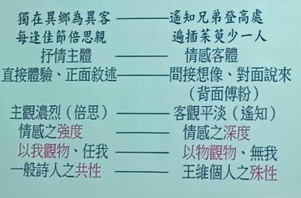

# 唐诗 -- 万花筒与望远镜

 * 5.11 - 5.12，深圳
 * 台大中文系
 * 欧丽娟教授
 * 《[孤独的多棱镜][1]》


## 初唐的宇宙视野

 * 宇宙，两个维度
 * 宇，空间的永恒
 * 宙，时间的永恒


### 学者的历观

 * 当代新诗已发展百年，也该出李白、杜甫？
 * 盛唐之所以是五言、七言的鼎盛时代，是有历史传承的，不是简单的百年发展

无规矩不成方圆

 * 初唐，开始讲究"平平仄仄，格律"
 * 有格律，可以训练；在规矩之中，才能表达出最佳的美感
 * 艺术(art)，都是人设计出来的东西，形式呈现(格律)，形式很重要
 * 当代新诗，无形式要求，无千锤百炼之美

艺术的发展与传承

 * 隋炀帝
 * 一位被安放在帝王位置的诗人（有点像陈后主 :-)）

```
夜露含花气．
春潭漾明月。
汉水逢游女，
湘川值两妃。
```

 * 《天净沙·秋思》中枯藤、老树、昏鸦
 * 来源于隋炀帝

```
枯藤老树昏鸦，
小桥流水人家，
古道西风瘦马。

夕阳西下，
断肠人在天涯。
```

### 唐·张若虚<春江花月夜>

 * 明·王世懋《唐诗解》卷十一："句句以春江花月状成一篇好文字。"
 * 明·锺惺《唐诗归》卷六："将春、江、花、月、夜五字炼成一片奇光，分合不得，真化工手。"
 * 清·徐增《而庵说唐诗》卷四："此诗如连环锁子骨，节节相生，绵绵不断。"、"春、江、花、月、夜五个字，各各照顾有情。诗真艳诗，才真绝才也。"

总纲

 * 每一段都是七言
 * 1 - 2: 生，月光，广阔
 * 3 - 4: 过去、未来（宙，时间）
 * 5: 游子
 * 6 - 9: 思妇

细解

 * "海上明月共潮**生**"
 * 生，生发，生机勃勃；而不是"升"，升，只有升起之意
 * 
 * "月照花林皆似霰" / "汀上白沙看不见"
 * 月光，广袤、皎洁、明净

```
春江潮水连海平，海上明月共潮生。
滟滟随波千万里，何处春江无月明！
江流宛转绕芳甸，月照花林皆似霰；
空里流霜不觉飞，汀上白沙看不见。
```

 * 开始引入"人"，人与月、与月光的邂逅
 * 有人，就有了各种情绪

```
江天一色无纤尘，皎皎空中孤月轮。
江畔何人初见月？江月何年初照人？
人生代代无穷已，江月年年望相似。
不知江月待何人，但见长江送流水。
```

 * 谁"夜扁舟子"？游子
 * 游子思乡之情

```
白云一片去悠悠，青枫浦上不胜愁。
谁家今夜扁舟子？何处相思明月楼？
```

 * 思妇

```
可怜楼上月徘徊，应照离人妆镜台。
玉户帘中卷不去，捣衣砧上拂还来。
此时相望不相闻，愿逐月华流照君。
鸿雁长飞光不度，鱼龙潜跃水成文。
昨夜闲潭梦落花，可怜春半不还家。
江水流春去欲尽，江潭落月复西斜。
斜月沉沉藏海雾，碣石潇湘无限路。
不知乘月几人归，落月摇情满江树。
```

### "生"字的延续

 * 王湾《次北固山下》："海上**生**残夜，江春人旧年。"
 * 张九龄《望月怀远》："海上**生**明月，天涯共此时。"
 * 陈子昂《感遇三十八首》之一："微月**生**西海。"
 * 崔融《关山月》："月**生**西海上。"


## 盛唐的恢弘

### 历史维度

 * 唐：290年
 * 初唐：100年
 * 盛唐：50年
 * 中唐：70年
 * 晚唐：50年

安史之乱

 * 天宝14年，开始安史之乱，打了七年多
 * 天宝13年，人口普查：5000万
 * 十年之后，人口普查：1700万
 * 死亡率：60%
 * 目前世界上人口死亡率最高的一场战争
 * 对当时人心的影响：空前绝后
 * 
 * 安史之乱，盛唐 => 中唐(没落的帝国) => 晚唐(苟延残喘的末世)


### 王维：水穷云起的智慧

 * 王维，字右丞
 * 
 * 长安的明星：盛唐诗坛的桂冠
 * 全方位的天才（诗、画、音乐）
 * 哲学家诗人：只有四百多首诗
 * 王昌龄评："人间出世心"
 * 
 * 水穷云起："行到水穷处，坐看云起时"
 * 入世与出世之间，随时切换，灵动自如
 * 
 * 400余首，多作于盛唐时期
 * 晚年很少写诗
 * 
 * 欧老师是王维铁杆粉

#### 《九月九日忆山东兄弟》（时年十七）

 * 1-2句，写自己，有我
 * 3-4句，写家人，无我

```
独在异乡为异客，
每逢佳节倍思亲。
遥知兄弟登高处，
遍插茱萸少一人。
```



#### 《桃源行》（时年十九）

 * 陶渊明《桃花源记》
 * 桃花源，东方名族内心的乌托邦
 * 
 * 王维的《桃源行》
 * 十九岁时的出世之心

```
渔舟逐水爱山春，两岸桃花夹古津。
坐看红树不知远，行尽青溪不见人。
山口潜行始隈隩，山开旷望旋平陆。
遥看一处攒云树，近入千家散花竹。
樵客初传汉姓名，居人未改秦衣服。
居人共住武陵源，还从物外起田园。
月明松下房栊静，日出云中鸡犬喧。
惊闻俗客争来集，竞引还家问都邑。
平明闾巷扫花开，薄暮渔樵乘水入。
初因避地去人间，及至成仙遂不还。
峡里谁知有人事，世中遥望空云山。
不疑灵境难闻见，尘心未尽思乡县。
出洞无论隔山水，辞家终拟长游衍。
自谓经过旧不迷，安知峰壑今来变。
当时只记入山深，青溪几度到云林。
春来遍是桃花水，不辨仙源何处寻。
```

#### 《终南别业》

 * "兴"，兴致，兴起则行
 * "行"无路则"坐"，看看"云起"，又是一片天空
 * 
 * 偶然碰到林叟，笑谈忘了时间。
 * 写意、自然，随心所欲不逾矩。
 * 
 * 偶然碰到的一位老头，如何能谈笑忘记了时间？
 * 上课时立即想到 Steve Jobs 的 "stay hungry, stay foolish" 

```
中岁颇好道，晚家南山陲。
兴来每独往，胜事空自知。
行到水穷处，坐看云起时。
偶然值林叟，谈笑无还期。
```

与苏轼对比

 * 《定风波》："莫听穿林打叶声，何妨吟啸且徐行。"
 * 自云："上可以陪玉皇大帝，下可以陪悲田院乞儿。"
 * 
 * "莫听"，不听，说明心意已经动，不想听，怕被扰动
 * 而王维的诗句中看不到被扰动的意思

嫁娶观

 * 《唐诗》王维："妻亡不再娶，三十年孤居一室，屏绝尘染。"
 * 在当时的时代，一夫多妻是很正常的，妻亡不娶，实属异类。

#### 《相思》

 * [红豆][2]，红豆树上的果实，又名相思子
 * 不是我们经常吃的红豆 :-)
 * 
 * 全唐诗，王维第一人，用红豆代表相思
 * 晚唐温庭筠(812-870)："玲珑骰子安红豆，入骨相思知不知？"

```
红豆生南国，
春来发几枝。
愿君多采撷，
此物最相思。
```


#### 《辋川集》

 * 王维隐居辋(wang3)川时的山水诗集合，二十首，二十景
 * 每一首都透出"清素淡雅、出尘脱俗"的意境

##### 辋川集·鹿柴

 * 柴(zhai4)
 * 鹿柴，围鹿的栅栏
 * 
 * "不见人" 却 "但闻人语"
 * 空寂，又生机勃勃，以动衬静
 * 
 * 景(ying3)，日光
 * "深林"，树，枝叶繁复、茂密，阳光好不容易
 * 从多层的树叶间，找到一缕空隙，照到青苔之上
 * 
 * "复照"，"复"，非第一次
 * 这一缕阳光，让"青苔"可以刚刚好存活
 * 对"青苔"而言，"多一分太多，少一分不可"
 * 
 * 树叶，交错，光的瞬间，斑光
 * 画家的画面感

```
空山不见人，但闻人语响。
返景入深林，复照青苔上。
```

##### 辋川集·竹里馆

 * 歌曲《[竹里馆][3]》

```
独坐幽篁里，弹琴复长啸。
深林人不知，明月来相照。
```

##### 辋川集·辛夷坞

```
木末芙蓉花，山中发红萼。
涧户寂无人，纷纷开且落。
```

#### 《酌酒与裴迪》

 * 裴迪没考上进士，王维为了劝慰他写的一首诗
 * 
 * 关于人性的洞察
 * "人情翻覆似波澜" / "白首相知犹按剑"

```
酌酒与君君自宽，人情翻覆似波澜。
白首相知犹按剑，朱门先达笑弹冠。
草色全经细雨湿，花枝欲动春风寒。
世事浮云何足问，不如高卧且加餐。
```

#### 兼谈儒释道

庄子

 * "人心险于山川，难于知天" / "相刃相靡(mi3)"
 * 
 * 《齐物论》，癞之人（TODO）
 * 受经年累月之苦，怀悲天悯人之心
 * 
 * 看得起儒家，天天评儒家
 * 对儒家的评价："明乎礼仪而陋于知人心"
 * 
 * 入而能出：庄子
 * 往而不返：屈原

#### 空间与时间的艺术表现形式

 * 《拉奥孔》，朱光潜
 * 
 * 空间艺术：绘画
 * 时间艺术：音乐、文学
 * 接受信息的方式不同
 * 
 * 景物是空间的艺术，用文字这种时间表现形式，则
 * 文字要短，以突出整体性
 * 反例：《奥德赛》中描写盾牌的精细，用了两页纸，完全无感，丢失了整体性
 * 
 * 如果非要用绘画表达时间的叙事
 * 画最精彩的一瞬间，让人用联想，去补充整个事件的其他内容


## 后记

 * 机缘巧合，能听到欧老师的唐诗史观，幸甚。
 * 个人，不过是历史洪流的一瞬间
 * 个人的渺小，只有在历史的大潮中才能体悟
 * 
 * 也许，我们又一次处于大唐盛世的前夜，感谢、感激时代给予个人的馈赠。
 * 感谢小鹿，有了这次听课的机会 :-)

[1]:https://www.iqiyi.com/v_19rr6miz5s.html
[2]:https://baike.baidu.com/item/%E7%BA%A2%E8%B1%86/7038
[3]:https://y.qq.com/n/yqq/song/001RHLFh2NrARr.html
