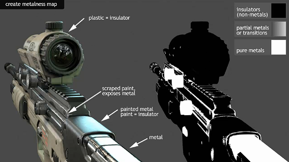
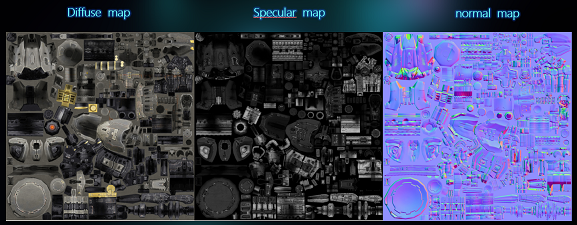
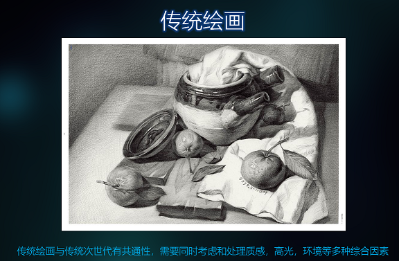
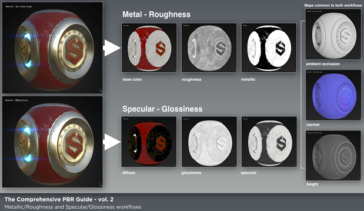
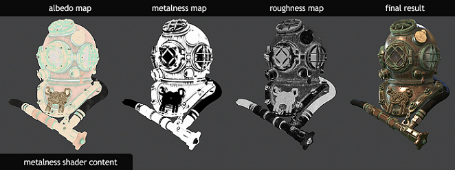
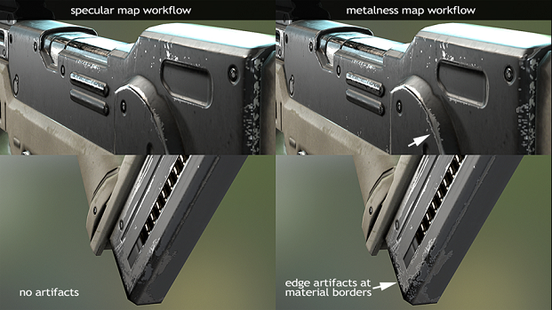
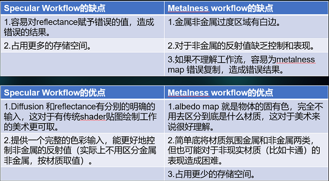
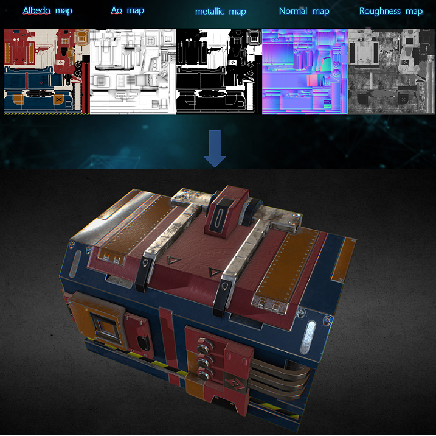
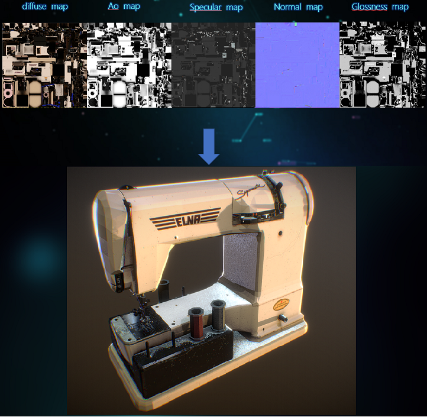

# PBR材质及渲染技术

## PART 1 - 什么是PBR？

它是一种基于物理渲染，**通过对真实世界物理现象进行逼近、模拟、再现，使3D对象在不同环境下都能展现出逼真的渲染质感**，并通过材质参数化将材质制作这一手工工业流程转化成为标准化、流水化的工业流程。 

### PBR的优点

 * PBR贴图，给予准确的物理公式，可以更容易创作出写实风格的物体，去除了那些主观理解的感觉数据
 * 物体在不同光照下都可呈现正确的样子，勿需再为了不同光照制作不同贴图
 * 所提供的工作流程甚至可以在不同美工之间创建始终如一的美术作品

## PART 2 - PBR与传统次世代

 * 左图：传统着色器
 * 右图：PBR着色器

### 啥叫 metalness map(金属度贴图)

 * 0.0 - insulators(绝缘体)
 * other - 金属和绝缘体之间
 * 1.0 - pure metals(纯金属)

### 传统次世代贴图

 * diffuse(漫反射贴图)，物体的颜色和明暗
 * specular(高光贴图)，高光
 * normalmap(法线贴图)，凹凸感

### 传统绘画

 * 需要绘制明暗，对美术要求高
 * 传统次世代流程，对美术绘制贴图的要求高

### PBR贴图类型

传统次世代的贴图，信息不正交。PBR就是重新设计了贴图的含义，将信息正交化。

PBR贴图制作流程

 * 将传统的 diffuse map 拆分为 albedo map 和 cavity/ao map
 * 将传统的 specular map 拆分为 specular map 和 gloss map

PBR贴图分类

 * albedo map，物体的颜色贴图
 * cavity/ao map，物体凹凸点的明暗关系
 * specular map，高光贴图
 * gloss map，光泽贴图

不是说还有个 roughness map 么？

 * roughness map = 1 - gloss map
 * 看引擎，有些引擎用  roughness map，有些引擎用 gloss map
 * 但 Substance Painter 输出的 roughness map 对应于 unity3d 的 gloss map（fuck! who is wrong?)

## PART 3 - metalness(金属度) 和 specular(高光) 流程

### PBR有两种流程

 * PBR下的少林与武当
 * Metallic/Roughness，"金属度 & 粗糙度"模型
 * Specular/Glossiness，"高光度 & 光滑度"模型

### 两者的区别

在继续深入之前我们应该清楚 Metalness Workflow 和 Specular Workflow 的基本区别，虽然大多数引擎都会选择支持一种或两种都同时支持。

两种工作流最大的区别在于怎样在贴图中呈现 diffuse 和 refectivity。例如在 specular workflow 下，这两者由明确区分的两种贴图来呈现。

而 metalness workflow 下，albedo map 则同时包含了 diffuse 和 reflectivity 的信息，而 metalness map 则用于区分金属和非金属。这是因为金属导电，这就意味着绝大多数光子（光）会在其表面发生反射，而其余的光子则会被吸收而不是发生漫发射，所以金属没有漫发射的概念。相反绝缘体则会反射一小部分光（大约4%），而大部分的光则是发生漫反射或在物体表面弹射从而形成均与分布的颜色。

这就意味着在 metalness workflow 下的实践中，diffuse map 和 specular map 基本就是浪费。反过来说 metalness workflow 就更加高效，但它（在一张贴图中同时储存 diffuse 和 specular 信息）也有一个缺点，那就是在贴图中金属和非金属的过度部分会有明显的白色痕迹。

Gloss map 和 roughness map 定义了相同的信息，但通常是相反的意义。在 gloss map 中，亮色表示光滑（有光泽），而 roughness map 亮色则表示粗糙（无光泽）。在一些领域，Glossiness 这个词和 reflectivity 同意，有人认为用 roughness 更不容易造成误解。当然，重要的并不是怎么命名而是他们的数值所代表的含义。

当然也有些 metalness workflow 提供了 secondary specular map 来对非金属的反射做更好的控制表现。

### Metalness Workflow 示例

### Specular Workflow 示例

## PART 4 - PBR贴图制作实战

Substance 软件套件，生产PBR贴图的工具链。

 * [Substance B2M][3]，对于专业美术来说，没用
 * [Substance Designer(SD)][1]，用可视化编辑来制作材质球
 * [Substance Painter(SP)][2]，将材质球组合一下，变成智能材质球，然后用于角色

工作流

 * SD => SP => output 各种 textures

[1]:https://www.allegorithmic.com/products/substance-designer
[2]:https://www.allegorithmic.com/products/substance-painter
[3]:https://www.allegorithmic.com/products/bitmap2material
