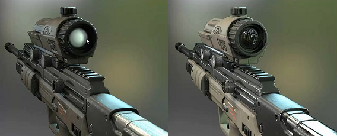

# PBR材质及渲染技术

## 什么是PBR？

它是一种基于物理渲染，**通过对真实世界物理现象进行逼近、模拟、再现，使3D对象在不同环境下都能展现出逼真的渲染质感**，并通过材质参数化将材质制作这一手工工业流程转化成为标准化、流水化的工业流程。 

### PBR的优点

 * PBR贴图，给予准确的物理公式，可以更容易创作出写实风格的物体，去除了那些主观理解的感觉数据
 * 物体在不同光照下都可呈现正确的样子，勿需再为了不同光照制作不同贴图
 * 所提供的工作流程甚至可以在不同美工之间创建始终如一的美术作品

## PBR与传统次世代

 * 左图：传统着色器
 * 右图：PBR着色器

### 啥叫 metalness map(金属度贴图)

 * 0.0 - insulators(绝缘体)
 * other - 金属和绝缘体之间
 * 1.0 - pure metals(纯金属)

### 传统次世代贴图

 * diffuse(漫反射贴图)，物体的颜色和明暗
 * specular(高光贴图)，高光
 * normalmap(法线贴图)，凹凸感

### 传统绘画

 * 需要绘制明暗，对美术要求高
 * 传统次世代流程，对美术绘制贴图的要求高

### PBR贴图类型

传统次世代的贴图，一张贴图的信息不够正交。PBR就是重新设计了贴图的含义，将信息正交化。

PBR贴图制作流程

 * 将传统的 diffuse map 拆分为 albedo map 和 cavity/ao map
 * 将传统的 specular map 拆分为 specular map 和 gloss map

PBR贴图分类

 * albedo map，物体的颜色贴图
 * cavity/ao map，物体凹凸点的明暗关系
 * specular map，高光贴图
 * gloss map，光泽贴图

不是说还有个 roughness map 么？

 * roughness map = 1 - gloss map
 * 看引擎，有些引擎用  roughness map，有些引擎用 gloss map
 * 但 Substance Painter 输出的 roughness map 对应于 unity3d 的 gloss map（fuck! who is wrong?)

## metalness(金属度) 和 specular(高光) 流程

## 应用范围

## 制作案例

