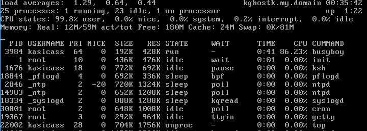

# Shell 命令偷偷教

掌握最基本的、最实用 *nix shell 命令。

## 总纲

shell 中有很多常用命令，日常维护看看 log 啥的，很实用。

shell 也可以用来写一些复杂的逻辑，但逻辑复杂后，shell 就远不如一门脚本语言（比如 python）来得方便了。

不是专业的 SA (system administrator)，不学 shell 中编程相关的那些 if ... else ... 等等。
只专注学习基本的一些命令就好。

随便找个 Linux/BSD/Mac 系统，打开 shell，开始玩吧。
（本教程例子是在 OpenBSD 5.9 中玩的）


## 基础篇

```Shell
$ <- shell 的提示符
# <- 我是注释
```


**pwd，请告诉我，当前在哪个目录？**

```Shell
$ pwd
/home/kasicass/shell_beginner
```


**whoami，显示当前登录的 user id**

```Shell
$ whoami
kasicass
```


**ls，看看当前目录下有啥**

```Shell
$ ls
a.out    hello    hello.c my.c

# -l 显示详细信息
$ ls -l
total 40
-rwxr-xr-x  1 kasicass  kasicass  6709 Mar   9 23:25 a.out
-rwxr-xr-x  1 kasicass  kasicass  6710 Mar   9 18:19 hello
-rw-r--r--  1 kasicass  kasicass    60 Mar   9 18:59 hello.c
-rw-r--r--  1 kasicass  kasicass    77 Mar   9 23:40 my.c

# -a 显示隐藏文件（目录也是文件的一种）
$ ls -la
total 48
drwxr-xr-x  2 kasicass  kasicass   512 Mar   9 23:25 .
drwxr-xr-x  4 kasicass  kasicass   512 Mar   9 18:06 ..
-rwxr-xr-x  1 kasicass  kasicass  6709 Mar   9 23:25 a.out
-rwxr-xr-x  1 kasicass  kasicass  6710 Mar   9 18:19 hello
-rw-r--r--  1 kasicass  kasicass    60 Mar   9 18:59 hello.c
-rw-r--r--  1 kasicass  kasicass    77 Mar   9 23:40 my.c
```


**echo，我说啥，你说啥**

```Shell
$ echo hello
hello

$ echo "Baby aaa"
Baby aaa

$ echo "Baby\"aaa"
Baby"aaa

# > 创建新文件，并写入内容
# >> 将内容写入文件尾部(append to file)
# 以及如何用 echo 输入多行内容
$ echo "#include <stdio.h>" > my.c
$ echo "int main(void) {" >> my.c
$ echo "  printf(\"Hello, Shell\");
>   return 0;
> }" >> my.c

# cat 干啥用的，看下一节
$ cat my.c
#include <stdio.h>
int main() {
  printf("Hello, Shell");
  return 0;
}

# 啊哈，帅不帅，我们写了个 C 程序
# "Hello, Shell" 后面没有 '\n'，所以提示符($) 跟在了 Shell 后面。
$ cc my.c
$ ./a.out
Hello, Shell$
```


**man，呼叫 help~**

man，取 manual 之意。通常也称 man page。

```Shell
$ man echo
```


manpage 其实就是整个 Linux/BSD/Mac 系统中 shell命令、系统API、Driver 等等各种文档的大集合。如果 shell命令 和 系统API 有重名咋办。这就涉及到不同的 section 了。

```Shell
# 用 j, k 或者 上/下箭头，上下翻滚页面内容
$ man write
```


```Shell
# 去 section 2 中查找
$ man 2 write
```


用浏览器打开 [http://www.openbsd.org/cgi-bin/man.cgi][1]，可以看到 OpenBSD 所有 manpage 的分类(sections)。


**cat，看看文件中有啥内容**

```Shell
$ echo "aaa" > foo.txt
$ cat foo.txt
aaa

$ echo "bbb" > bar.txt
$ cat bar.txt
bbb

$ cat foo.txt bar.txt > concat.txt
$ cat concat.txt
aaa
bbb
```


**cd，跳转目录**

```Shell
$ cd /home/kasicass/c_beginner
$ pwd
/home/kasicass/c_beginner

# $HOME 和 ~ 是等价的
# $HOME 返回 HOME 这个环境变量的值
$ cd $HOME
$ pwd
/home/kasicass
$ cd ~
$ pwd
/home/kasicass

# 顺带讲讲环境变量，比如 $PATH 是 shell command 的搜寻顺序
# 如果 /bin/foo 和 /sbin/foo 这两个程序同时存在，输入 $ foo 优先执行 /bin/foo
# $PATH 中的路径，使用 : 分隔的
$ echo $PATH
/home/kasicass/bin:/bin:/sbin:...
```


**mkdir，创建目录**

```Shell
$ pwd
/home/kasicass/shell_beginner

$ mkdir mydir
$ cd mydir
$ pwd
/home/kasicass/shell_beginner/mydir
```


**touch，创建空文件**

```Shell
$ touch foo.c
$ ls
foo.c
$ cat foo.c
$             # display nothing
```


**rm，删文件、目录**

```Shell
# rm -rf 用来删除整个目录
# 小心，别乱用 "rm -rf /"，嘿嘿
$ touch bar.c
$ rm bar.c
$ cd ../
$ rm -rf mydir
```


**tail, 显示文件最后几行**

```Shell
# 其实最常用的是 tail -f，用来看最新的 log 内容
# 比如有个文件叫 foo.txt，有个程序会不停地给 foo.txt 中写 log
# tail -f 可以一直看到最新的 log。
$ touch foo.txt
$ tail -f foo.txt &       # & 表示将 tail -f 放到后台运行

$ echo "aaa" >> foo.txt
aaa                       # tail -f print出来的 内容

$ echo "bbb" >> foo.txt
bbb
```


**ps, 看进程列表**

```Shell
$ ps
  PID TT  STAT           TIME COMMAND
 1676 C0  Ssp         0:00.39 -ksh (ksh)
13684 C0  Ip          0:00.00 tail -f foo.txt
15914 C0  R+p         0:00.00 ps
```


**kill，干掉某个进程**

```Shell
$ kill 13684
[1] + Terminated         tail -f foo.txt

$ echo "ccc" >> foo.txt
$                        # tail -f 已经被干掉了，不再有 print 内容
```


**top, 监控当前CPU占用情况**

```Shell
$ cat busyboy.c
int main(void) {
  while (1)
    ;
  return 0;
}

$ cc busyboy.c -o busyboy
$ ./busyboy &

$ top
```



```Shell
# 按 q 退出 top
$ kill 3984    # 干掉这只 busyboy

$ clear        # top 显示的内容占着屏幕，好烦躁。clear 清理一下。
```


**du, 查看文件大小**

```Shell
# du, display disk usage statistics
# 查看当前目录下哪个文件最大
$ du -sh `ls` | sort -r
4.0K   foo
2.0K   sedtest.txt
2.0K   data.txt
2.0K   bar.c
```

**df，查看磁盘空余大小**

```Shell
# -h 是 human readable 的意思，Size 改为 M/K 等大小。上面 du 那个也一样。
$ df -h
Filesystem     Size     Used    Avail    Capacity    Mounted on
/dev/wd0a      788M    46.0M     702M       6%       /
/dev/wd0e      252M    90.0K     239M       0%       /home
/dev/wd0d      893M     494M     354M      58%       /user   
```


**dmesg, 看看系统 log**

```Shell
# 查看机器启动后的一些系统log，方便查证一些问题
$ dmesg | more
```


```Shell
# 看看有没有进程因为内存不足，被干掉了
$ dmesg | grep "Out of mem"
...
```


**ifconfig, 看看本机IP**

```Shell
$ ifconfig
```


[1]:http://www.openbsd.org/cgi-bin/man.cgi
