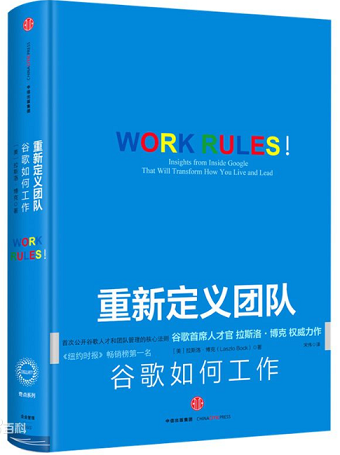

# Google - Work Rules




## CH01 - 成为一名创始人

 * 蒙氏教育(蒙台梭利)
 * 给学生自由，让他们按自己的节奏做事
 * 寻找工作的意义
 * 有意义，你会早上兴冲冲地起床
 * 群体决策

Team Creator

 * 想要所处地环境使你和周围的人都能够蓬勃进去
 * 首先就要为这个环境负起责任
 * 等到有一天，你的团队也会有一个起源故事
 * 你希望故事是怎样的？


## CH02 - "文化可以把战略当早餐一样吃掉"

如何了解一个群体的文化？

 * 查看他们的"人造物品"，比如实体空间和行为
 * 研究群体成员所信奉的信仰和价值观
 * 研究这些价值背后反映出的潜在意义

快乐工作、快乐生活~

 * 欢乐是非常重要的一部分
 * 使人不必谨小慎微，可以发挥开发和探索的能力

Google 的使命

 * "整合全球信息，使人人都能访问并从中受益"
 * 一个无限追求的愿景
 * 促使我们不断创新，探索新的领域

Google 文化基石

 * 使命
 * 透明
 * 发声的权利

使命

 * 在内心深处，每个人都想要找到工作的意义
 * 接触客户，可以更好的寻找到"工作的意义"

透明

 * 每周全员会议，拉里和谢尔盖向所有员工通告一周的最新情况
 * 同时有30分钟的现场问答时间，公司里任何员工都可以提问
 * 信息分享，使每一个人都了解不同团队的目标差异
 * 避免重复劳动、内部竞争

发声的权利

 * 给员工真正的话语权
 * 让员工毫无保留地表达观点
 * 对于"决策的水平、团队的表现和组织的表现"有积极的影响

思考

```
一旦你选择要像一位创始人一样思考和行动，
你的下一个决定就应该是想要打造哪种类型的文化。
你对员工怀着怎样的信念，
你有没有勇气如你心中挂念所怀信念一般对待员工？

未来的数十年里，
地球上最具天赋、工作最努力的一些人，
都会涌向允许他们做有意义的工作、帮助塑造组织命运的地方。
```

亚当.格兰特

 * 沃顿商学院最年轻的终身教授
 * 《[GIVE AND TAKE: Why Helping Others Drives Our Success][1]》
 * 《[Originals: How Non-Conformists Move the World][2]》


[1]:https://item.jd.com/12379130.html
[2]:https://item.jd.com/25694154448.html


