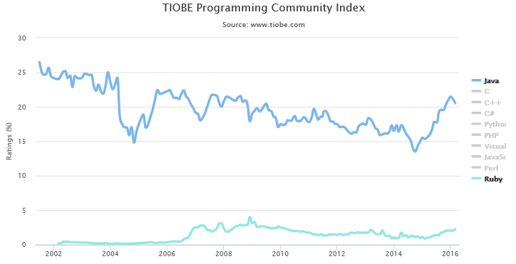

# J2EE当年的那些事

Warning: **我不是 Java 程序员。:-) 以下只是我自己的看法。**

Java圈里面有本挺出名的书《Better, Faster, Lighter Java》，是2004年 Bruce A. Tate 的作品。我在一位 C# 大牛的 Blog 上，都看到此书的推荐。

当年 J2EE JavaBeans 那坨坨东西越来越厚重，写个简单网页都封装了一层又一层。搞得好麻烦，性能自然也就不咋地啦。

《Better, Faster, Lighter Java》提出了 Hibernate + Spring 的轻量型组合，一样可以把事情搞定。之后 Java 大型网页开发，就走出了 J2EE 和 轻量型 两种路线。随着互联网需求变化越来越快，轻量型方案更受亲睐。

Bruce A. Tate 并不满足轻量型方案，2005就又写了本《Beyond Java》来彻底抛弃 Java，拥抱 Ruby。我们也知道，Ruby 后来发展迅猛，Ruby on Rails 是很多中小型团队的标配。

我大学师兄当年做过一个创业项目。最早是用 Java 构架的，之后改用 Ruby on Rails 重写，号称速度提升了几倍。（当年Java的慢，J2EE功不可没吧 =_=!）

Joel on software 当年还给《Beyond Java》写了篇书评，讲的很好。

 * [http://www.joelonsoftware.com/items/2006/10/12.html][1]

Joel 将程序问题分为 accidental difficulty 和 actually difficult 两类。

 * accidental difficulty 就是本来可以由语言帮你解决的。比如 malloc/free 可以由 gc 帮你搞定。
 * actually difficult 则是实际要解决的问题。

一个语言应该尽量减少 accidental difficulty。

然后将语言进化分为了五大阶段：

 1. Assemblers
 2. Algebraic languages (including Fortran)
 3. Structured languages (Algol-60 and C)
 4. Declarative languages (including SQL)
 5. Memory-managed languages (including Lisp, VB, and Java)

并把 Ruby 定义为 the next （第6类）

好像歪楼了，我们回到 Java。=_=!

Java 真的很慢么？我们来看看 Java/Ruby 的流行度排行榜。

Ruby 并没有像想象中的，一飞冲天。而 Java 依旧是 No.1 的编程语言。

除了历史遗留项目外，更大的原因是 performance。从语言本身来说，Java 还是比 Ruby 快几个数量级的。

对于大型项目，比如 Android 的系统语言来说，如果 Google 选用了 Ruby，估计 Android 慢得如蜗牛。再想想当年 Vista 大量用了 C# 的那个慢，之后 Win7 据说很多模块又改回 C++ 了。同样道理，啊哈~

最后我们来说说 JSP 和 JSF。JSF 说起来是 JSP 的进化版，但其实它就是走 ASP.NET WebForm 的老路，将 HTTP stateless 的东西，硬要封装成 stateful，并且隔离掉 HTML/CSS 等等。What the fuck~

看看 ThoughtWorks 对 JSF 的批评吧（[https://en.wikipedia.org/wiki/JavaServer_Faces][2]）

其实语言标准委员会那群人也经常走错路。啊哈~

[1]:http://www.joelonsoftware.com/items/2006/10/12.html
[2]:https://en.wikipedia.org/wiki/JavaServer_Faces
