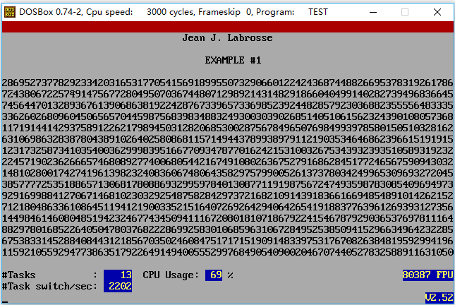
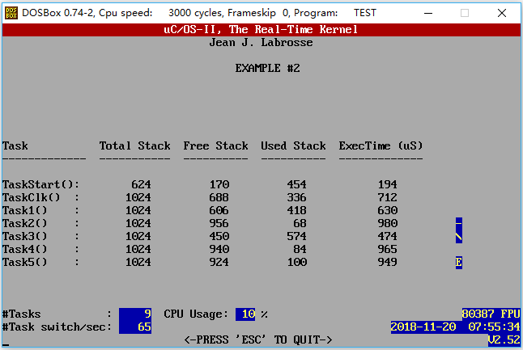

# [uC/OS-II] 第一章 - 初始 uC/OS-II

嵌入式操作系统，和普通操作系统不同。

 * 把嵌入式操作系统看成一个 Library
 * 你的 App 和操作系统的 Library 链接到一起，成为一个 binary

## 范例1 - 多任务处理能力



 * OSXxx 的函数，属于 uC/OS-II 的
 * PC_xxx 函数，属于 x86 平台相关
 * OSTaskCreate() 的时候，需要自己指定 stack pointer，因为是 x86，需要指向高位地址（&TaskStartStk[TASK_STK_SIZE-1]）
 * PC_VectSet(uCOS, OSCtxSw)，指定 uC/OS-II 中的任务切换处理函数。任务级的任务切换通过调用 80x86 的 INT 指令引发中断，通过其向量地址调用指定的处理函数。这里使用了 0x80 的向量，因为 DOS 和 BIOS 都没有使用这个向量。
 * OSStart()，控制权交给 uC/OS-II，开始任务调度。

```C
#include "includes.h"

#define  TASK_STK_SIZE     512                /* Size of each task's stacks (# of WORDs)   */
#define  N_TASKS           10                 /* Number of identical tasks                 */


OS_STK      TaskStk[N_TASKS][TASK_STK_SIZE];  /* Tasks stacks                              */
OS_STK      TaskStartStk[TASK_STK_SIZE];
char        TaskData[N_TASKS];                /* Parameters to pass to each task           */
OS_EVENT   *RandomSem;

        void Task(void *data);                /* Function prototypes of tasks              */
        void TaskStart(void *data);           /* Function prototypes of Startup task       */
static void TaskStartCreateTasks(void);
static void TaskStartDispInit(void);
static void TaskStartDisp(void);

void  main(void)
{
    /* Clear the screen */
    PC_DispClrScr(DISP_FGND_WHITE + DISP_BGND_BLACK);

    OSInit();                   /* Initialize uC/OS-II                      */

    PC_DOSSaveReturn();         /* Save environment to return to DOS        */
    PC_VectSet(uCOS, OSCtxSw);  /* Install uC/OS-II's context switch vector */

    RandomSem = OSSemCreate(1); /* Random number semaphore                  */

    OSTaskCreate(TaskStart, (void *)0, &TaskStartStk[TASK_STK_SIZE - 1], 0);

    /* Start multitasking */
    OSStart();
}
```

## 范例2

