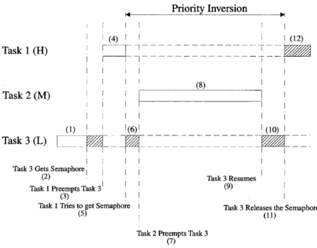
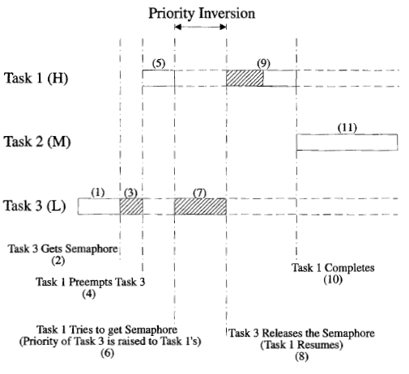

# [ESBB] Embeded Systems Build Blocks


[《Embeded Systems Build Blocks》][1]也是 uC/OS-II 作者的作品，主要介绍了一些嵌入式开发中可重用的库。


## Real-Time System Concepts

### Foreground/background system

整个系统只有一个程序，你的 App 和 Kernel link 到一起，成为一个程序。

执行流程只会被中断（ISR）打断。


### Multi-tasking

uC/OS-II Kernel 设计为 multi-tasking 的模式。

 * 任务可以模块化拆分
 * 抢占式优先级


### Task states

Task 的状态机


### 可重入

可重入函数（Reentrant function）

 * 数据都在 stack 上，context switch 没问题

```C
void strcpy(char *dest, char *src)
{
    while (*dest+= = *src++) {
      ;
    }
    *dest = NULL;
}
```


不可重入函数（Non-reentrant function）

```C
int Temp;


void swap(int *x, int y)
{
    Temp = *x;
    *x   = *y;
    *y   = Temp;
}
```

访问了全局的数据，context swtich 有可能会有问题


### 优先级反转问题（Priority Inversion）

 * Task 3(L) 拿了一个 Semaphore
 * Task 1(H) 需要 此Semaphore
 * 导致一段时间内，获得了比 Task 1(H) 更高的优先级



一些 Kernel 支持 priority inheritance，可以缩短 priority inversion 的时间

 * Task 3(L) 拿了 semaphore 之后，短暂的优先级提高到与 Task 1(H) 一样
 * uC/OS-II 不支持 priority inheritance




[1]:https://book.douban.com/subject/1840113/
