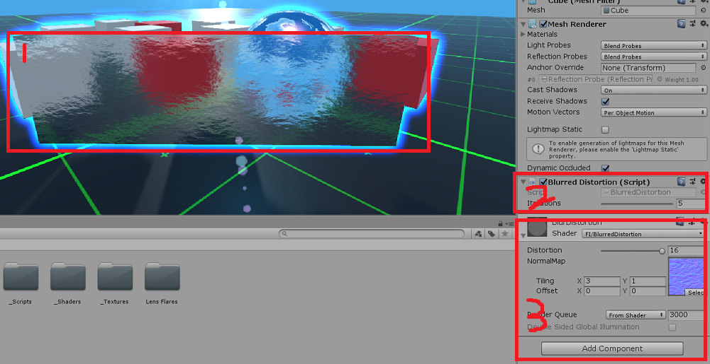

# [Unity3D] About Graphics Command Buffers

听美术同学多次说起 Unity3D 的 Command Buffers，花10分钟学了下，写个 blog，备忘。:-)


## 原理

 * 将 3D Draw API 的内容，封装到 C# 层面
 * 在 rendering pipeline 的某个阶段，将 command buffer 插入进去，用于生成某些需要的贴图，也成为 RT(rendering target)
 * 位于 [Unity.Rendering.CommandBuffer][2]


## Demo 实例

 * 以 [Introduction To CommandBuffer][3] 为例，解读之



 * (1) 毛玻璃效果的面片，挂接了 (2) 和 (3)
 * (2) MonoBehaviour (.cs 文件)
 * (3) shader 文件

Tick & Rendering

 * (2) 先运行，处于引擎的 Tick 阶段
 * (3) 后运行，处于引擎的 Rendering 阶段


### 解读 MonoBehaviour (.cs 文件)

 * new CommandBuffer(), 一堆 3D API 指令集合
 * blurredGrabTex = Shader.PropertyToID("_BlurredGrabTex"); 和 shader 那边关联起来
 * Camera.main.AddCommandBuffer()，在渲染的某个阶段，插入这段 buffer 指令(3D API 指令集合)
 * buffer.GetTemporaryRT(), 创建 temporary render target

```C#
using System.Collections;
using System.Collections.Generic;
using UnityEngine;
using UnityEngine.Rendering;

namespace FI
{

    public class BlurredDistortion : MonoBehaviour
    {
        [SerializeField, Range(0, 3)]
        private int iterations;

        private CommandBuffer buffer;

        private Material gaussianBlurMaterial;

        private int temporaryTex;
        private int blurredGrabTex;

        // -------------------------------------
        private void Start()
        {
            CreateBuffer();
            InitializePropertiesAndMaterials();
        }

        // ------------------
        private void Update()
        {
            UpdateBuffer();
        }

        // ----------------------------------------------------------
        private void InitializePropertiesAndMaterials()
        {
            temporaryTex = Shader.PropertyToID("_TempGrabTex");
            blurredGrabTex = Shader.PropertyToID("_BlurredGrabTex");

            gaussianBlurMaterial =
                new Material(Shader.Find("FI/GaussianBlur"));
        }

        // ---------------------------------------------------------------
        private void CreateBuffer()
        {
            buffer = new CommandBuffer();
            buffer.name = "BlurredGrabTexture";
            Camera.main.AddCommandBuffer(CameraEvent.AfterSkybox, buffer);
        }

        // --------------------------------------------------------------------------
        private void UpdateBuffer()
        {
            buffer.Clear();

            buffer.GetTemporaryRT(blurredGrabTex,
                  -2, -2, 0, FilterMode.Bilinear);
            buffer.GetTemporaryRT(temporaryTex,
                -2, -2, 0, FilterMode.Bilinear);

            buffer.Blit(BuiltinRenderTextureType.CurrentActive, blurredGrabTex);

            for (int i = 0; i < iterations; i++)
            {
                buffer.Blit(blurredGrabTex, temporaryTex, gaussianBlurMaterial, 0);
                buffer.Blit(temporaryTex, blurredGrabTex, gaussianBlurMaterial, 1);
            }
        }
    }
}
```


### 解读 shader 文件

 * sampler2D _BlurredGrabTex，采样的贴图，由 .cs文件 中的 "Command Buffers 代码" 生成
 * 相当于 diffuse map 从 .cs 中生成

```Cg
Shader "FI/BlurredDistortion"
{
	Properties
	{
		_Distortion("Distortion", Range(0, 16)) = 8
		_NormalMap("NormalMap", 2D) = "bump" {}
	}

	SubShader
	{
		Tags { "RenderType"="Transparent" "Queue"="Transparent" }
		LOD 100

		Pass
		{
			CGPROGRAM

			#pragma vertex vert
			#pragma fragment frag
			
			#include "UnityCG.cginc"

			struct v2f
			{
				float2 uv : TEXCOORD0;
				float4 uvgrab : TEXCOORD1;
				float4 vertex : SV_POSITION;
			};

			sampler2D _NormalMap, _BlurredGrabTex;
			float4 _NormalMap_ST, _BlurredGrabTex_TexelSize;
			float _Distortion;

			v2f vert (appdata_base v)
			{
				v2f o;
				o.vertex = UnityObjectToClipPos(v.vertex);
				o.uv = TRANSFORM_TEX(v.texcoord, _NormalMap);
				o.uvgrab = ComputeGrabScreenPos(o.vertex);
				return o;
			}
			
			fixed4 frag (v2f i) : SV_Target
			{
				float2 bump = UnpackNormal(tex2D(_NormalMap, i.uv)).rg;
				float2 offset = _Distortion * bump * _BlurredGrabTex_TexelSize.xy;

				#if defined(UNITY_Z_0_FAR_FROM_CLIPSPACE)
					i.uvgrab.xy = offset * UNITY_Z_0_FAR_FROM_CLIPSPACE(i.uvgrab.z) + i.uvgrab.xy;
				#else
					i.uvgrab.xy = offset * i.uvgrab.z + i.uvgrab.xy;
				#endif

				fixed4 col = tex2Dproj(_BlurredGrabTex, UNITY_PROJ_COORD(i.uvgrab));
				return col;
			}

			ENDCG
		}
	}
}
```


## github 上的例子

 * [Introduction To CommandBuffer][3]
 * [Unity Command Buffers][4]


## 参考资料

 * 官方介绍：[Graphics Command Buffers][1]
 * API 参考：[Unity.Rendering.CommandBuffer][2]
 * move哥的文章：[Command Buffers in Unity][5]


[1]:https://docs.unity3d.com/Manual/GraphicsCommandBuffers.html
[2]:https://docs.unity3d.com/ScriptReference/Rendering.CommandBuffer.html
[3]:https://github.com/faiguago/Introduction-To-CommandBuffer
[4]:https://github.com/colourmath/UnityCommandBuffers
[5]:https://mp.weixin.qq.com/s?__biz=MzUzMTI4NTA1Mw==&mid=2247484033&idx=1&sn=0beef47d2cf4c5def7c1fb121cefbeb3&chksm=fa4597d3cd321ec519418b3c6f8b4d4ff155f08de2fda253ffb3ae1afcb9d957562395991643&mpshare=1&scene=1&srcid=0421kZn7oEOMH4sPbbsUZAeJ&key=e0570729d1f6881061b626c5bf78a3f2ad5973f6b3971000665ab0230759c91cd37e0d66e11a0b3d08fbd0206ba841d9cc5564ae654fa6b58e1513cabfe5ea44a0e321cd42001fafecb75f7c508d5614&ascene=1&uin=MTgzNzQ3MDAw&devicetype=Windows+10&version=62060739&lang=zh_CN&pass_ticket=D0Mlpy00B7wI4ZIYAHt0p66oSi%2BIicrwpDtLJj0frf4%3D
