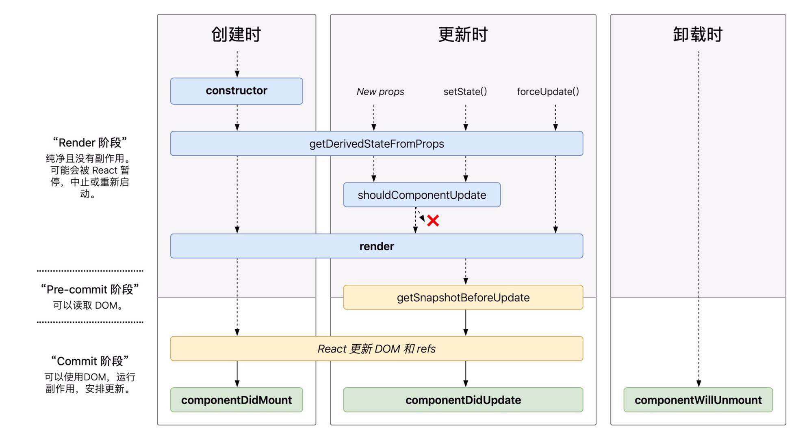

# React Component 生命周期

React Component可以用class和function来定义，而通过extends React.Component继承的则会拥有Component的生命周期,function定义的Component(Stateless Component)则只有render函数而没有其他生命周期。

* [React.Component](#Component生命周期示意)
* [Stateless Component](#StatelessComponent)

## Component生命周期示意


### Mounting（创建时）
在Component创建时进行调用的生命周期方法，其中包含了Component第一次出现，以及被插入DOM中时，会按顺序触发一下方法

* [constructor()](#constructor)
* [static getDerivedStateFromProps()](#static_getDerivedStateFromProps)
* [render()](#render)
* [componentDidMount()](#componentDidMount)

### Updating（更新时）
修改props或者state造成的re-render,或者调用[forceUpdate()](#forceUpdate)方法时会调用以下生命周期函数
* [static getDerivedStateFromProps()](#static_getDerivedStateFromProps)
* [shouldComponentUpdate()](#shouldComponentUpdate)
* [render()](#render)
* [getSnapshotBeforeUpdate()](#getSnapshotBeforeUpdate)
* [componentDidUpdate()](#componentDidUpdate)

### Ummounting （卸载时）
从DOM上remove时会调用
* [componentWillUnmount()](#componentWillUnmount)

## 方法列表

### constructor()
调用时机：当组件第一次被mounted时，进行调用。及当Component以<Component />形式被加入的时候。

使用方法：一般只在该方法初始化state和绑定方法至自身或其他instance上

> 1. 当继承自React.Component时，必须在所有方法前优先调用super(props),如果不调用this.props将会是undefined的
> 2. 使用this.state = {}方式初始化state，而不要使用setState的方式。
> 3. this.state = { color: props.color},用props值给state赋值只有在赋默认值时使用，因为后续修改props.color将不会反应到state.color上，对于props中的默认值最好用default去描述，并提供另一个不包括default描述的参数去强制修改默认值（若有需要的话）

### static_getDerivedStateFromProps()
调用时机：此方法在每次组件变更时，包括创建（constructor之后）和更新时都会调用。

使用方法：由于该方法拥有两个参数（props， state)，因此该方法适合用于需要依赖之前之后变化的情况,比如过场动画。

> 官网建议了三个替代方案：
> 1. If you need to perform a side effect(for example, data fetching or an animation) in response to a change in props, use   _**componentDidUpdate()**_   lifecycle instead.
> 2. If you want to re-compute some data only when a prop changes,   _**use a memoization helper instead**_  . 
> 3. If you want to "reset" some state when a prop changes, consider either making a component  **_fully controlled_**  or  **_fully uncontrolled with a key_**  instead.

### render()
调用时机：此方法在每次组件变更时，包括创建和更新时都会调用。创建和调用foreUpdate时在[static getDerivedStateFromProps()](#static_getDerivedStateFromProps)后调用，new props和setState所造成的更新则会在[shouldComponentUpdate()](#shouldComponentUpdate)后调用，若该方法返回false，则render不会执行。

使用方法：return你需要展示的内容即可，return中可包含一下内容：
1. React elements。一般是JSX，包括不同的Component以及html标签
2. Arrays and fragments。渲染数组数据，列表等
3. Portals。作为子组件入口渲染，例如：{this.props.children}
4. Booleans or null.可以利用```boolean && <Component/> ```表示<Component /> 是否展示，boolean本身不会渲染任何内容。可以利用null不会渲染任何东西的特性，减少空列表等情况的处理。

> render尽量只做渲染工作，不要在该方法里修改setState的值，如果需要跟浏览器做交互，尽量放在componentDidMount()或者其他生命周期函数中。

### componentDidMount()
调用时机：在创建时，执行完render后，该Component会被插入到react tree中，成功mount后，会触发该方法。

使用方法：这里可以用来从远端获取数据，发起网络请求等，也可以注册一些调用方法，不过需要在componentWillUnmount()中进行取消。

> 在这个方法里，可以直接调用setState方法来改变state值，从而触发二次render，由于react机制原因，用户并不会感知到re-render，只会接受到第二次render的结果，如果要减少首屏时间，可以设置默认值，先进行默认页面的展示。

### shouldComponentUpdate()
调用时机：在setState或者new Props触发的更新时，在[static getDerivedStateFromProps()](#static_getDerivedStateFromProps)后调用。

使用方法：再确认某个props或者state没有更新则不需要调用render时，使该方法返回false，阻止render执行。其默认返回true。

> 如果是为了提升性能，且在当前Component中只要state以及props没有改变就不需要render时，请使用React.PureComponent,该类不再提供shouldComponentUpdate()方法，通过该组件自带比较方式确认state以及props没有发生数值上的更改就会阻止render执行。使用PureComponent时需保证子组件均为PureComponent。PureComponent只进行浅比较（类似基础类型比较），如果包含数组，对象等，可能会被误认为没有改变，这时候也可以使用forceUpdate进行强制更新。

### getSnapshotBeforeUpdate()
调用时机：发生在Component更新时，无论是setState，new Props 还是forceUpdate。

使用方法：该方法有两个参数（prevProps, prevState) ,即变化前的内容，可以在该方法中比较render前后的变化，对内容进行微调，比如修改滚动高度等。

### componentDidUpdate()
调用时机：[getSnapshotBeforeUpdate()](#getSnapshotBeforeUpdate)之后。

使用方法：包含三个参数（prevProps, prevState, snapshot),和[componentDidMount()](#componentDidMount)可做的事情基本一致，只不过多了上一个状态的内容，多了判断依据。

### componentWillUnmount()
调用时机：当组件不在被render返回，包括父亲节点以上的所有节点。被remove的父节点，会递归所有的子孙节点，从叶子节点开始调用所有的组件的componentWillUnmount()方法。

使用方法：可以在这里取消设置的监听事件，取消异步操作以防止监听回调被调用时，发现当前组件已被销毁。

> 1. 其依赖于react事件diff Dom树后，关闭浏览器标签，手动修改url等操作不会触发该事件，同理相关的无法触发正常移除事件的都不能触发该方法。
> 2. 不应该在该方法中修改state，因为该Component会在方法执行完后destroy掉，不会在进行render。官网原话：Once a component instance is unmounted, it will never be mounted again.


## Stateless Component
先来看一下babel解析结果
```
//Stateless Component
const Component = (props) => {
    return <div></div>
}

// babel解析结果
var Component = function Component(props) {
    return React.createElement('div', null);
}
```
相当于在整个Component的构造过程中没有了类对象的组件，而只有简单的React.createElement了，因此其并不包含除了render以外的所有生命周期函数，但是其本质还是一个React组件（应该是因为JSX识别为React的）。

简单列一下我认为的Stateless Component的特征：
1. 代码简洁，基本只包含了需要渲染的东西。
2. 仍然可以传入props作为渲染的依据（不需要this.props，直接props即可）
3. 没有state，无法使用，再简单组件中一般利用props重绘即可。
4. 没有this指针
5. 由于没有class Component的组件内容，渲染性能更优。
